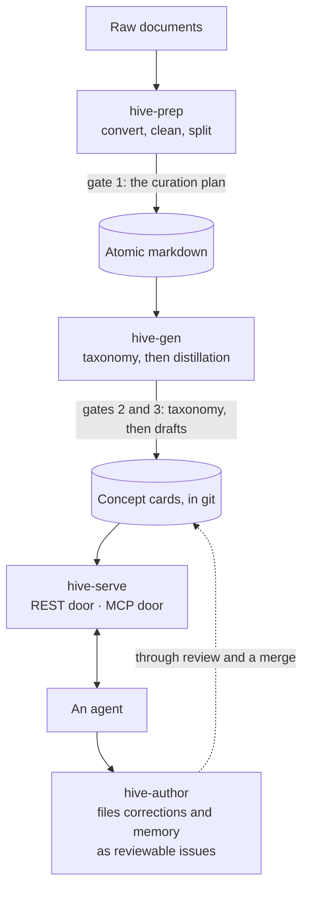
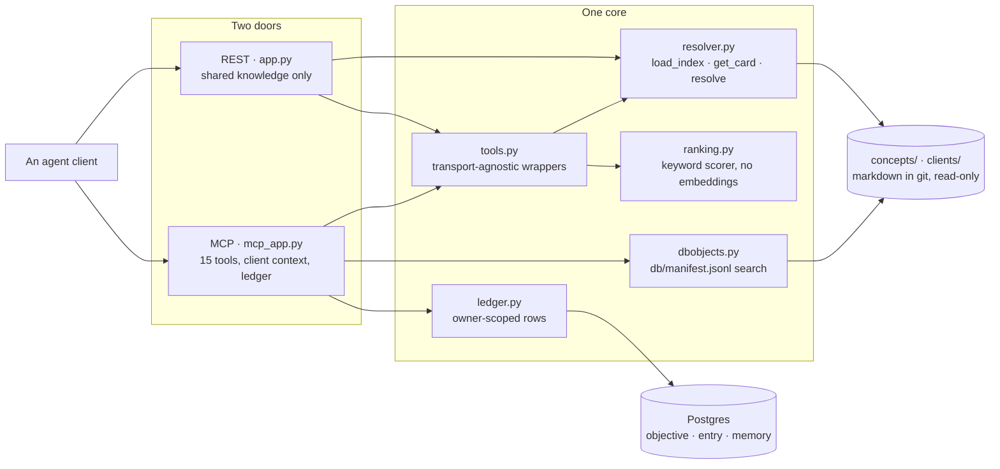
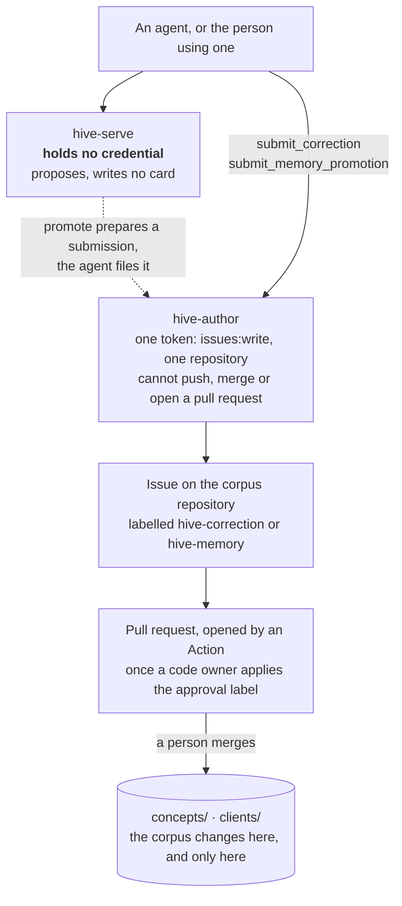

# Architecture

Three stages produce a corpus. One service serves it. Two stores keep knowledge and work state
apart.

This is the shape of the system in one page. For the long form, with every gate, the layers on top
and the diagrams, read [the pipeline end to end](pipeline.md).

Three stages and three gates a person has to pass, all of them in stages 1 and 2, and a write
path that comes back round through review rather than writing to the corpus directly:

## Stage 1: preparation

**`hive-prep`** takes a directory of raw documents in whatever formats they arrive in and produces
**atomic markdown**: one clean, single-topic file per source, with metadata frontmatter.

The governing idea is *put the intelligence up front in one reviewable file, then let deterministic
code do the rest*. A single model pass proposes what to keep, what is a duplicate, and how each
document should be classified. That proposal is written to a file, a person reviews and edits it,
and everything downstream is ordinary code operating on an approved plan.

This matters because the alternative, sprinkling model calls through every step, gives you a
pipeline whose behaviour you cannot review, reproduce or explain.

Commands run in sequence: `scan`, `dups`, `validate-plan`, `dedup-formats`, `normalize`, `route`,
`transform`, `stamp`, `validate-atomic`. See [hive-prep](../reference/hive-prep.md).

## Stage 2: card creation

**`hive-gen`** turns atomic markdown into cards in two model passes with a human gate after each.

**Taxonomy.** Given the documents for one functional area, the model proposes a list of concepts:
what distinct ideas are in here, and which documents cover each. This is written to
`taxonomy.<area>.draft.yaml` and the run stops. A person edits it into `taxonomy.<area>.yaml`.

Stopping here is the highest-leverage gate in the system. Getting the concept list right is most of
getting the corpus right, and it is far cheaper to fix a list of titles than a directory of
distilled prose.

**Distillation.** For each approved concept, the model reads its source documents and writes one
card. Drafts land in `drafts/` with `status: draft`. A person reviews and flips approved ones.

**Promotion.** `promote()` moves approved drafts into `concepts/<product>/`. Then a post-promote
run applies facets, checks conformance, and regenerates the index.

## Stage 3: serving

**`hive-serve`** is one core with two doors and two stores.

The read path, module by module. Both doors call the same transport-agnostic wrappers; only the MCP
door reaches the ledger and the database-object tier:

### One core

Both doors share retrieval wrappers and the resolver, but expose different client-context
surfaces. See [the resolver reference](../reference/hive-serve.md#the-resolver) for scope and
[the serving trust boundary](../guides/serving-cards.md#identity-and-what-it-is-not) for access.

### Two doors

**REST**, for anything that speaks HTTP:

| Route | Purpose |
|---|---|
| `GET /healthz` | liveness. See the warning below |
| `GET /metrics` | Prometheus exposition |
| `GET /concepts` | the lean index: ids, titles, products, types |
| `GET /find_concepts` | ranked keyword search over that index |
| `GET /card/{card_id}` | one card, raw |
| `POST /resolve` | several cards plus their corrections, as one bundle |

**MCP**, for any client that speaks it, exposing fifteen tools in three groups: retrieval (`list_concepts`,
`find_concepts`, `get_card`, `resolve`, `find_db_objects`), work state (`start_objective`,
`list_objectives`, `get_objective`, `append_entry`, `set_status`, `record_quiz_result`), and
personal memory (`remember`, `recall`, `forget`, `promote`).

> **`/healthz` does not check the corpus.** It reports that the process is up. A service with a
> stale or empty mount answers `{"ok":true}` while serving nothing. Alert on the card-count gauge
> instead; see [metrics](../reference/metrics.md).

### Two stores

| | Knowledge | Work state |
|---|---|---|
| What | cards | objectives, entries, personal memory |
| Where | markdown in git | Postgres |
| Lifecycle | reviewed, versioned, shared | mutable, per-person, private |
| Written by | curation, through review | the agent, during use |

They are never mixed. Knowledge is the thing many people rely on being true, so it goes through
review and lives in version control. Work state is one person's in-progress thinking, so it is
mutable and needs no ceremony.

Keeping them apart is what lets the corpus be trustworthy without making it annoying to use. It is
also why promoting a personal memory into shared knowledge is an explicit act that opens a
reviewable issue, rather than a database write.

## No model at serving time

`hive-serve` makes no model calls. The only ones in the system happen during content creation, in
stages 1 and 2.

Consequences worth naming:

- **Cheap.** Serving is file reads and, for work state, one database query.
- **Deterministic.** The same request returns the same cards, every time.
- **Auditable.** What the agent saw is exactly what is in git at that commit.
- **Portable.** No gateway, no keys, no vendor.

The reasoning is the agent's job. Hive's job is deciding what the agent is allowed to reason over,
and that decision was made by a person, earlier, on the record.

If you want semantic search as well, the corpus is plain markdown: embed the cards into your own
index and run both paths against the same content. See
[alongside an existing RAG system](../guides/alongside-rag.md).

## The write path

`hive-serve` holds no credentials, which is deliberate: the read path is the part exposed to the
widest audience, so it holds nothing worth stealing.

When someone wants to correct a card or promote a memory, **`hive-author`** files it as an issue
against the corpus repository. It is a separate service with a token scoped to issue creation and
nothing else. Review happens in the ordinary pull request flow, and the corpus changes only when a
person merges.

The chain of custody, and the one credential in it:

## Extensions

**`hive-dbparse`** turns schema DDL into `dbobject` cards deterministically, with no model. It fails
the whole run on any construct it cannot parse, rather than emitting a partial corpus, because a
schema card that quietly omits a column is worse than no card.

**`hive-zendesk`** distils closed support tickets into client-scoped `issue` cards, so recurring
problems are recognised rather than rediscovered.
