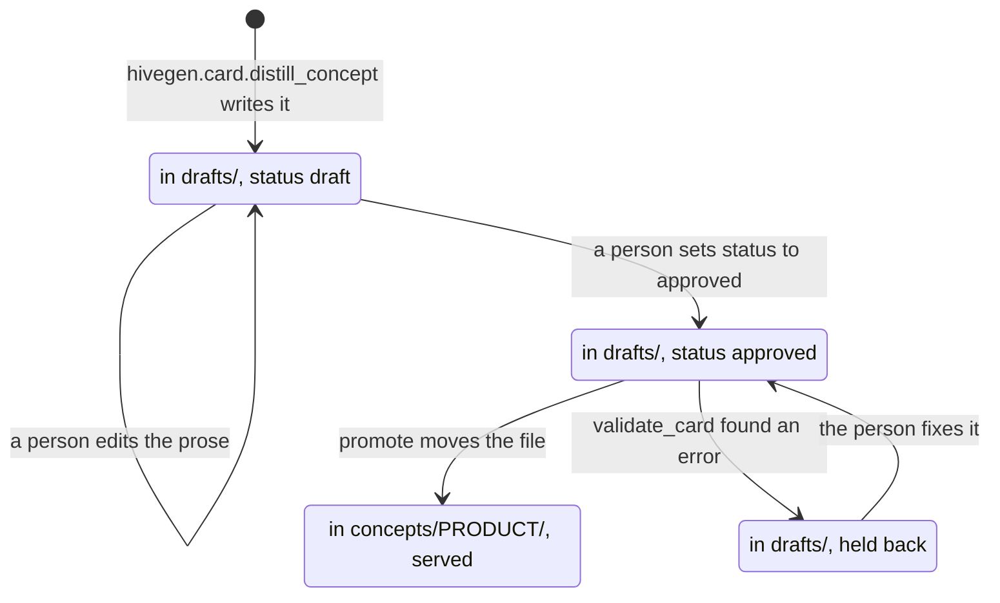
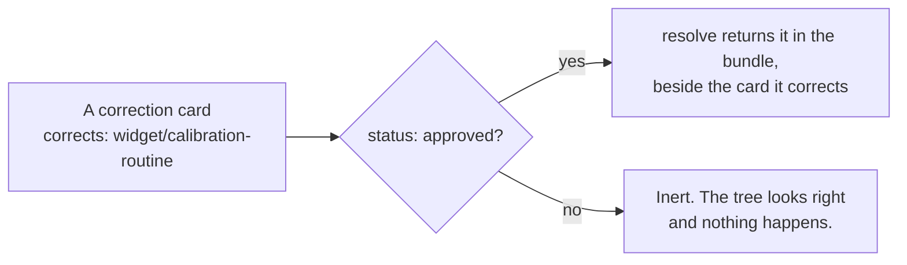

# Cards

A card is a markdown file with YAML frontmatter. That is the whole format. It is readable in any
editor, diffable in any review tool, and greppable without a running service.

The format is **OKF**, and it is deliberately separate from Hive. Hive can serve OKF cards it did
not write, and cards Hive writes are readable by anything that understands the format.

## Anatomy

```markdown
---
type: concept
title: Widget Calibration Routine
description: How a widget is calibrated after assembly, including the default
  tolerance and the recalibration interval.
product: widget
platform: bench
tags: [calibration, tolerance]
related:
  - widget/assembly-process
  - widget/widget-registry
sources:
  - kind: document
    ref: "Bench Operations Guide, section 4"
---

## Overview

A widget is calibrated after assembly and before sealing...
```

## Ids come from paths

A card has no `id` field. Its id is its path under the corpus root, without the `.md`:

```
concepts/widget/calibration-routine.md   ->   widget/calibration-routine
concepts/widget/db/tables/ORDERS.md      ->   widget/db/tables/ORDERS
```

This is a deliberate constraint, not a shortcut. An id that lives in frontmatter can drift from the
file that holds it, can be duplicated across files, and gives you two things to keep in step. A
path-derived id cannot be wrong, because the filesystem enforces uniqueness for you. Renaming a
card changes its id, which is correct: it is a different card now, and every link to the old id
breaks loudly rather than resolving to something stale.

The corollary is that **the folder layout is part of the contract**. Products are top-level folders
under `concepts/`; clients are top-level folders under `clients/`.

## The lifecycle of a card

A card carries one lifecycle field, `status`, and each package recognises the values its own job
needs. The concept-card path uses two of them: `hivegen.card` writes `draft`, and
`hivegen.promote.promote`, the only thing that moves a file out of `drafts/`, moves nothing that is
not already `approved`:



A card is held back when a required frontmatter key is missing, when a `related` id names no card
the corpus or the draft set knows, or when a card of that name is already promoted; `promote` names
each reason and leaves the file where it is.

There is no rejected state and no deleted state either. A draft nobody approves simply stays in
`drafts/`: `promote` passes over it, naming it neither among the cards it promoted nor among the
ones it held back, rather than failing the run.

Two more values are expected elsewhere, and a card carrying either is not malformed.
`hive-zendesk` stamps every issue card it emits with `status: distilled`, and re-emits that card on
a later run unless a person has flipped it to `approved`, which it preserves. A correction or
memory card displaced by a newer one is flipped to `status: superseded` and kept in git for
history, which is what `corrections_lint` and `memory_lint` check the `supersedes` graph against;
see [supersede, do not delete](pipeline.md#corrections-fixing-a-card-without-editing-it).

The one value that changes what is served is `approved` on a correction:
`hiveserve.resolver.corrections_by_target` attaches only corrections carrying it, so a correction
in any other state is inert. Memory and issue cards are indexed whatever their `status` says, which
is why a superseded memory left marked `approved` is caught by `memory_lint` rather than by the
resolver.

## The five types

| `type` | Lives in | Purpose |
|---|---|---|
| `concept` | `concepts/<product>/` | the substance: one idea, explained once |
| `correction` | `concepts/<product>/corrections/` | overlays a concept that has gone out of date |
| `dbobject` | `concepts/<product>/db/` | a table, view or routine, generated from schema |
| `memory` | `clients/<client>/memory/` | something learned about one client |
| `issue` | `clients/<client>/issues/` | something that happened at one client |

For how these types participate in retrieval, see [the resolver's scope rules](../reference/hive-serve.md#the-resolver).
Client scoping is not an identity-based read restriction; [the serving trust boundary](../guides/serving-cards.md#identity-and-what-it-is-not)
sets out the access model.

### concept

The default. Self-contained prose about one idea, cross-linked to related concepts. If you cannot
state what a concept card is about in one sentence in its `description`, it is probably two cards.

### correction

Corrections are the mechanism that lets a corpus stay true without rewriting history.

```yaml
type: correction
title: Calibration tolerance is 0.25 units, not 0.5
corrects: widget/calibration-routine
status: approved
```

`corrects` names the card being corrected. When the resolver returns that card, it attaches the
correction alongside, so the agent sees both the original statement and the amendment.

**A correction is only applied when `status: approved`.** A draft correction is inert. This is easy
to trip over: a correction that looks right in the tree but has no `status` line silently does
nothing, and the corpus continues serving the outdated claim.

That single branch, as `resolver.corrections_by_target` applies it:



The original card is never edited. That is the point: you can see what was believed, when it
changed, and who changed it, which is the audit trail that makes a curated corpus trustworthy.

### dbobject

Generated by [`hive-dbparse`](../guides/database-objects.md) from schema DDL, with no model
involved. These are excluded from the concept index and resolved on demand, because a schema of any
size would otherwise swamp everything else. See [database objects](../guides/database-objects.md).

### memory

A durable note scoped to one client, usually a deviation from the general case: "this client runs a
tighter tolerance than the standard". Memory cards carry `submitted_by` and reach the corpus
through review rather than being written directly. See
[corrections and memory](../guides/corrections-and-memory.md).

### issue

Something that went wrong at a client, and what resolved it, so the next occurrence is recognised
rather than rediscovered. Usually distilled from support tickets by
[`hive-zendesk`](../guides/issue-journal.md).

## Facets

Facets are selection dimensions carried in frontmatter. They narrow what a query can reach without
splitting the corpus into separate stores.

| Facet | Meaning |
|---|---|
| `product` | which product the card belongs to |
| `platform` | which platform or environment it applies to |
| `regime` | which operating regime it assumes |
| `version` | which release it describes |
| `client` | which client it belongs to (memory and issues only). **Derived from the card's path, not read from frontmatter** - a card cannot declare itself into another client's scope |

`product` is the load-bearing one. Cards in different products are lexically distinct and carry no
edges between them, so a query scoped to one product cannot drift into another. This is a soft
filter by design: the isolation comes from the corpus having no cross-product links to follow, not
from a guard that has to be remembered.

`client` is different, and it is worth being precise about how. The resolver derives it from the
card's path and applies it to every listing, search and bundle traversal, so one client's memory and
issue cards never arrive in an answer scoped to another. That is a **retrieval** boundary and it is
enforced consistently.

It is **not** an access control. The client is chosen by the caller, not derived from who the caller
is, and every card sits in one repository that anyone with read access can read in full. A
deployment that needs clients to be unable to reach each other's material needs separate corpora
with separately controlled access. See
[the serving trust boundary](../guides/serving-cards.md#identity-and-what-it-is-not).

## Links and citations

`related` lists other card ids. The distillation stage is constrained to only emit ids that already
exist, so the link graph cannot invent targets.

`sources` records provenance. A card that cannot say where its content came from is a card nobody
can check, which defeats the purpose of curating in the first place.

## The index

Each corpus has a root `index.md` carrying `okf_version`, plus a per-product `index.md`. These are
generated rather than written by hand.

The root index is **the only place frontmatter version metadata belongs**. Individual cards do not
carry `okf_version`: the corpus has a format version, not each file.

## What the format does not have

No embeddings. No chunk boundaries. No scores or rankings. No database.

A corpus is a directory of text files, and every property Hive relies on is visible by reading
them. If Hive disappeared tomorrow the corpus would still be a well-organised, cross-referenced
knowledge base that a person could read.
