# The pipeline, end to end

How a raw vendor document becomes a grounded answer inside an agent. This is the long-form
reference: every stage, every gate, and the mechanisms layered on top of them.

[Architecture](architecture.md) is the short version. Read that first if you want the shape;
read this when you need to know how a stage actually works.

Diagrams are [Mermaid](https://mermaid.js.org/) and render inline on GitHub.

## Contents

1. [The big picture](#the-big-picture)
2. [Design principles](#design-principles)
3. [Stage 1: document preparation](#stage-1-document-preparation)
4. [Stage 2: card creation](#stage-2-card-creation)
5. [The layers on top](#the-layers-on-top)
6. [Stage 3: serving](#stage-3-serving)
7. [The two stores](#the-two-stores)
8. [End to end, one thread](#end-to-end-one-thread)

## The big picture

Hive turns a pile of raw documentation into a **curated, cross-linked knowledge base of atomic
concept cards in git**, and serves those cards to an agent, with a per-person **work ledger**
underneath.

Three subsystems, each a self-contained Python package under `tooling/`, chained into one pipeline:

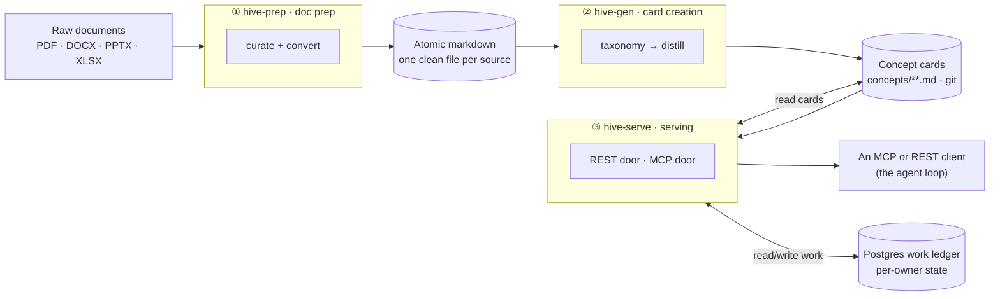

**The whole thing is LLM-free at serving time.** The agent is the reasoning loop. The only
server-side model calls happen during content creation, in stages 1 and 2, on whatever gateway the
deployment configures.

## Design principles

| Principle | What it means in practice |
|---|---|
| **Portable** | No SaaS knowledge product, no external index. A model gateway and a document converter, both swappable by configuration. |
| **Git is the system of record** | Cards are plain markdown. Curation gates are pull requests and diffs. Zero infrastructure, auditable, and readable without Hive. |
| **The model proposes, a human disposes, git records** | Every model stage writes a *reviewable artifact* and stops. Nothing reaches the corpus without a human flip. |
| **LLM-free serving** | The serving layer calls no model. It retrieves cards and records work state. |
| **Two clean stores** | Knowledge is read-only versioned git. Work state is mutable per-person rows in Postgres. Never mixed. |
| **Small and recoverable** | One new piece of infrastructure, a Postgres database, which is one your platform already knows how to back up. Pipelines degrade gracefully: conversion runs without a GPU if the vision tier is unavailable. |

## Stage 1: document preparation

**Goal:** take a folder of raw, messy vendor documents and produce **atomic markdown**, one clean
single-topic file per source, labelled with metadata, that stage 2 can distil.

**Package:** `tooling/hive-prep` (module `hiveprep`, CLI `hiveprep`).

The pipeline, short form:

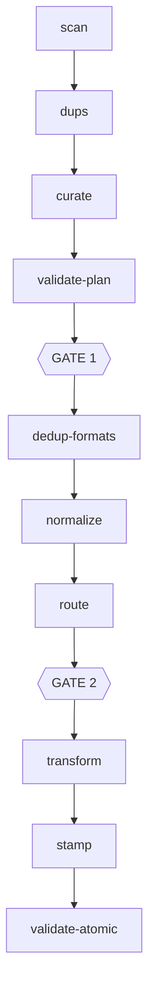

### The flow

The governing idea: **put the intelligence up front in one reviewable file, then let deterministic
code do the rest.** A single model pass decides *what to keep and how to label it*. Everything
after it is repeatable code operating on an approved plan.

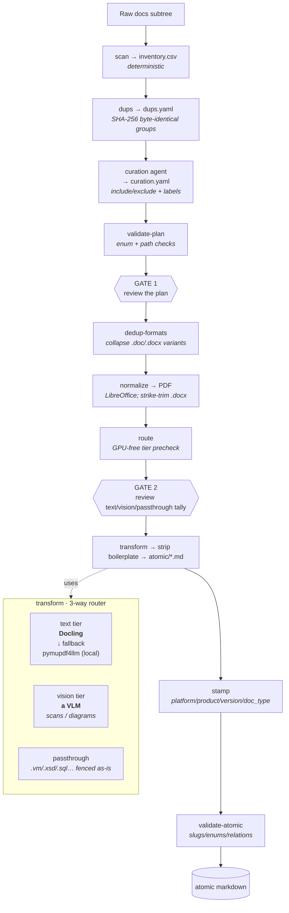

**Three kinds of actor**, and it helps to know which is which:

| Actor | Good at | Where |
|---|---|---|
| **A model** (the curation agent) | judgment, reading content | **curate**: what to keep, how to label it |
| **Deterministic code** | repeatable, free | scan, dups, validate, dedup, normalize, transform, stamp |
| **You** | approval, accountability | the two review gates |

**The curation agent is deployment-supplied.** Hive ships the mechanism; the agent that makes the
judgment call knows a particular corpus's vocabulary, so it lives with that corpus. See
[building a corpus](../guides/building-a-corpus.md).

### The converter, in detail

`transform.py` profiles each normalized PDF (average characters per page, image dominance) and
**routes** it:

- **Text-rich** goes to the **text tier**: the file is sent to **Docling** (best tables and
  layout), falling back to local `pymupdf4llm` on any failure, so the pipeline still runs with no
  GPU.
- **Image-dominant**, a scan or a screenshot-heavy deck, goes to the **vision tier**: each page is
  rendered and described by an OpenAI-compatible VLM. Most born-digital corpora barely touch this
  tier; it is the fallback for scanned material.
- **Already-text formats** (`.vm`, `.xsd`, `.xml`, `.json`, `.sql`, `.properties`) go to
  **passthrough**: fenced into markdown as-is.

Immediately before an atomic file is written, output from the **text and vision tiers** (never
passthrough, because you do not regex-scrub fenced code) passes through the **boilerplate
stripper**: tunable YAML rules that remove copyright lines, trademark notices, confidentiality
banners, "Page X of Y" footers, and table-of-contents dot leaders. Rules are scoped to footer and
header *form* so they cannot delete real prose.

That is separate from strike-trimming, which removes tracked-change text earlier, at the `.docx`
level, inside `normalize`.

Every atomic file records how it was made:

```yaml
---
title: "Platform Architecture"
slug: platform-architecture
topic: platform architecture
doc_type: technical-spec        # a closed, validated vocabulary
version: unknown
product: EXAMPLE
platform: EXAMPLE_PLATFORM
source_doc: "Platform_Architecture.pptx"
extracted_via: text             # text | vision | passthrough
status: active
---
```

Module-level detail: [hive-prep reference](../reference/hive-prep.md).

## Stage 2: card creation

**Goal:** distil atomic markdown into **concept cards**, one card per concept, cross-linked.

**Package:** `tooling/hive-gen` (module `hivegen`). Concept-centric and gate-aware: it does one
stage, writes a reviewable artifact, and stops.

### The flow, three gates

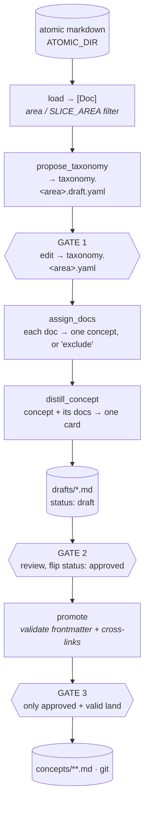

- **Load** reads atomic markdown into a source-agnostic `Doc {id, name, text}`. The **slice lever**
  is the area registry plus the `SLICE_AREA` setting: distillation runs one functional area at a
  time, so a corpus is built area by area rather than all at once.
- **Taxonomy** asks the model for a fine-grained list of concepts. **Gate 1: you curate what
  concepts exist.** This is the highest-leverage gate in the system, because getting the concept
  list right is most of getting the corpus right, and a list of titles is far cheaper to fix than a
  directory of distilled prose.
- **Assign** classifies each document into exactly one concept, or `exclude`.
- **Distill** concatenates a concept's assigned documents and produces `{title, description, tags,
  related, body}`. The `related` ids are **constrained to the real taxonomy**, so links cannot be
  hallucinated. Output lands in `drafts/` as `status: draft`. **Gate 2: you review and flip.**
- **Promote** validates required frontmatter and that every `related:` id resolves, then moves
  valid approved drafts into `concepts/`. **Gate 3: only approved and valid land.**

Which model runs each step is configuration. See the
[configuration reference](../reference/configuration.md).

### The card, anatomy

A card is markdown with frontmatter and curated prose. The frontmatter makes it a node in a graph:
`related:` gives the edges, `sources:` gives the provenance.

```yaml
---
type: concept
title: Replenishment Logic, Excess Wave Need Processing
description: Logic for moving inventory from reserve to pick locations during a wave…
tags: [replenishment, wave, pick-location]
resource: /card/example/base-replenishment-logic   # a PATH, not a host
sources:
  - kind: vendor-doc
    ref: example-2013-replenishment-logic.md        # traces back to the atomic source
related:
  - example/shipping-wave-replenishment-subprocess  # path-id edges into the graph
  - example/replenishment-process-flow
distilled_at: '2026-06-30'
timestamp: '2026-06-30'
status: approved
product: example                                    # facets: selection and isolation
platform: example-platform
version: ['2018', '2020']
---

## Overview
…self-contained, reusable prose (the bulk of the value)…

## Related
- [Shipping Wave Replenishment Subprocess](/example/shipping-wave-replenishment-subprocess.md)

# Citations
1. `example-2013-replenishment-logic.md`
```

The card lives at **`concepts/<product>/<id>.md`** and **its concept id is that path**. `## Related`
and `# Citations` are regenerated from the frontmatter, so the graph and the provenance are visible
to any OKF consumer, not only to `hive-serve`.

> **`resource` is a path by default, deliberately.** A card outlives any one deployment's hostname.
> One corpus was written with absolute URIs and every card had to be rewritten when the deployment
> changed domains. Override with `CARD_BASE_URL` only where absolute URIs are genuinely needed, and
> expect to pay that rewrite next time.

### Post-promote: facets, conformance, index

Promotion lands cards in `concepts/<product>/`, but they are not *servable-ready* until five
deterministic, **idempotent, LLM-free** passes run over the whole directory. Run this after every
distillation:

| Step | Runs | What it does |
|---|---|---|
| **Facet stamp** | `scripts/product_facet_apply.py` | stamps `product`, `platform`, `version` onto the product's cards |
| **Version facet** | `scripts/version_apply.py` | derives `version` from source-reference years. No model, no gate |
| **Regime facet** | `scripts/regime_apply.py` | stamps a within-product either-or facet from a human-reviewed classification; drives the cross-regime expansion guard |
| **Conformance** | `hivegen-conformance-pass` | sets `resource`, adds `timestamp`, regenerates `## Related` and `# Citations` |
| **Index** | `hivegen-index-generate` | writes the root and per-product `index.md` progressive-disclosure listings |

This takes the corpus from *formally* conformant (parseable frontmatter) to *idiomatically*
conformant: path-id identity, a graph expressed as inline links, citations, and a spec-shaped
index. Every pass is idempotent, so re-running leaves conformant cards untouched.

**The isolation eval is the deploy gate.** Before deploy, the eval harness over a product's
question set must show **zero cross-product bleed**, plus no regime or version regression. No
product ships without it.

Module-level detail: [hive-gen reference](../reference/hive-gen.md).

## The layers on top

Three mechanisms sit above the base pipeline. Each solves a problem the concept corpus alone cannot.

### Corrections: fixing a card without editing it

A card can be **wrong or stale** without anyone wanting to edit the distilled prose, which is a
reviewed artifact whose value is partly that it records what the source said.

A correction is an ordinary card at `concepts/<product>/corrections/<slug>.md` with
`type: correction` and `corrects: <path-id>`.

- **Surface, do not resolve.** The resolver reverse-looks-up the **active** corrections of every
  selected concept and **co-pulls** them into the bundle *after* the concept's own traversal,
  deliberately **unbudgeted**, because a correction must never be dropped or the wrong fact stands.
  The answer prompt treats it as authoritative.
- **Never selected, never listed.** Corrections are excluded from the selectable index and from
  index listings. They only ride along with their target.
- **Supersede, do not delete.** A newer correction can `supersedes:` older ones, flipping them to
  `status: superseded`, kept in git for history. More than one active correction on a concept is a
  **lint warning for a human**, never an auto-merge.

### Memory: what a practitioner learned

Concepts and corrections describe **how the product works**. Memory captures **what someone
learned**, especially client-specific operational knowledge. It lives in two tiers:

- **Personal, private, in the ledger.** Jotted with `remember`, recalled with `recall`
  (deterministic filtering, no model at serve time), removed with `forget`. Never enters git, never
  visible to another owner.
- **Global, shared, client-scoped, in git.** A promoted memory is a `type: memory` card at
  `clients/<client>/memory/<slug>.md`. **Selectable**, unlike a correction, within client context.

**The invariant:** memory is client-specific and lives in a `clients/<client>/` namespace, so it
**structurally cannot touch `concepts/`**. A lesson belonging in core knowledge is a correction or
a new concept, never a memory. Core documentation cannot be polluted by client specifics.

For selection and traversal, see [the resolver's client-scope rules](../reference/hive-serve.md#the-resolver).
These are retrieval controls, not authorization; see [the serving trust boundary](../guides/serving-cards.md#identity-and-what-it-is-not).

### The write path, and why the read door holds no credential

`hive-serve` is **keyless and read-only**. A separate minimal service, **`hive-author`**, holds the
only credential, scoped to **issue creation only**. It can file an issue; it can never push, merge
or open a pull request. A human approval label fires the workflow that builds the card and opens
the PR.

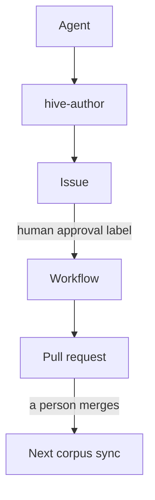

Two hard-separated tools that structurally cannot cross: `submit_memory_promotion` (requires a
client) and `submit_correction` (targets a core concept id).

**Conflict is a two-layer gate.** When a promoted memory would collide with another for the same
client on the same subject, a deterministic lint enumerates candidate pairs and an LLM judge scores
each. A genuine conflict **blocks the PR** until a human resolves it. The scorer is **fail-safe:
any model error scores as a conflict and blocks.**

### The database-object tier

Concept cards describe **how a product works**. They do not describe **the data model**: tables,
columns, types, keys, stored procedures.

**This is a different mechanism from stages 1 and 2.** Concept cards are *distilled by a model*
from messy prose, which involves judgment and paraphrase. Schema is exact and must stay exact, so
this tier is produced by a **deterministic parser with no model in the loop**, and its output is
verbatim. The engine is **sqlglot**: a real dialect-aware tokenizer and AST, never regex.

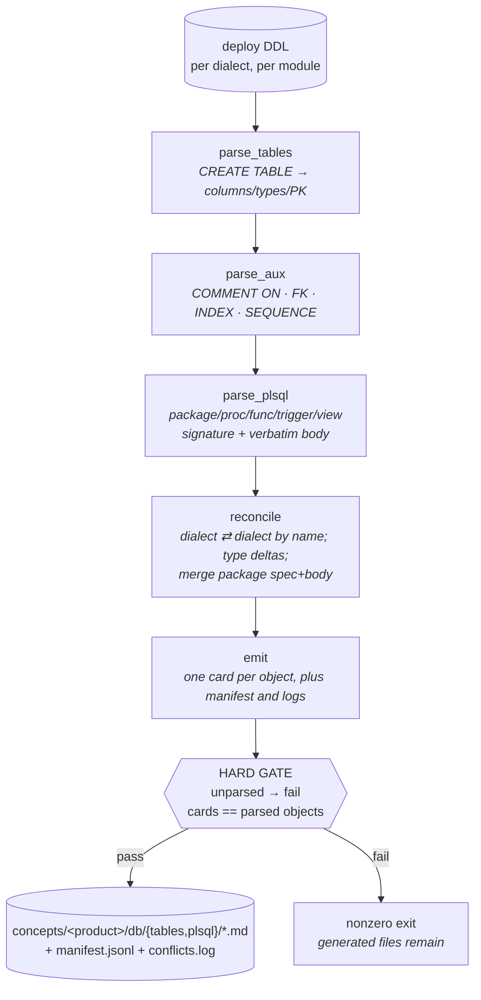

- **`parse_tables`** turns each `CREATE TABLE` into columns, primary key and inline constraints,
  degrading gracefully via a token-level fallback where the parser bails on storage clauses.
- **`parse_aux`** overlays out-of-line facts: `COMMENT ON` kept **verbatim** as the human
  description, foreign keys, indexes, sequences.
- **`parse_plsql`** captures every programmatic unit with its signature and **full body copied
  verbatim**. Unit boundaries come from the tokenizer, not line heuristics: a `/` terminates a unit
  only when it stands alone on its line, so a division inside a body cannot truncate it.
- **`reconcile`** matches definitions of the same object across dialects, records per-column and
  per-body deltas, and merges a package spec with its body.

**The hard verification gate is the point.** Card count must equal parsed-object count, and **any
unparsed construct fails the run**. That is what surfaces real-corpus DDL quirks instead of silently
dropping objects. Generated files are currently written before the gate is evaluated, so a failed
run can leave output behind; consume it only after a successful exit. Same-name collisions are
deduped when structurally identical and otherwise **logged, never silently overwritten**.

**Served on demand, kept out of the concept index.** This tier can be many times the size of the
concept corpus and is schema-level rather than narrative, so putting it in `list_concepts` would
drown concept retrieval. Db cards are reached **only** through `find_db_objects`.

### The issue-journal tier

Neither concepts nor memory record **what has actually gone wrong at a site**. The issue journal
adds one thin `type: issue` card per closed support ticket under `clients/<client>/issues/`.

**A journal entry is deliberately not a knowledge card.** Distilling each ticket into an
explanation would restate the concept corpus thousands of times and dilute retrieval. An entry
carries what happened, how it closed, and links to the concepts that explain the behaviour. Its
purpose is *awareness*. The skills state the contract explicitly: **an entry is a lead, never a
root cause.**

Two properties follow:

- **Client-scoped, like memory.** One client's incidents never reach another's answer.
- **Linking is a separate stage from distillation.** The distiller has never seen the corpus, so
  any card id it invents resolves rarely. Cards are emitted with `related: []` and linked
  afterwards against real ids by a model shown a shortlist and free to decline.

## Stage 3: serving

**Goal:** serve cards to people and tools, and track each person's *work*, without reintroducing a
heavy retrieval stack.

**Package:** `tooling/hive-serve` (module `hiveserve`, CLI `hiveserve`).

### One core, two doors, two stores

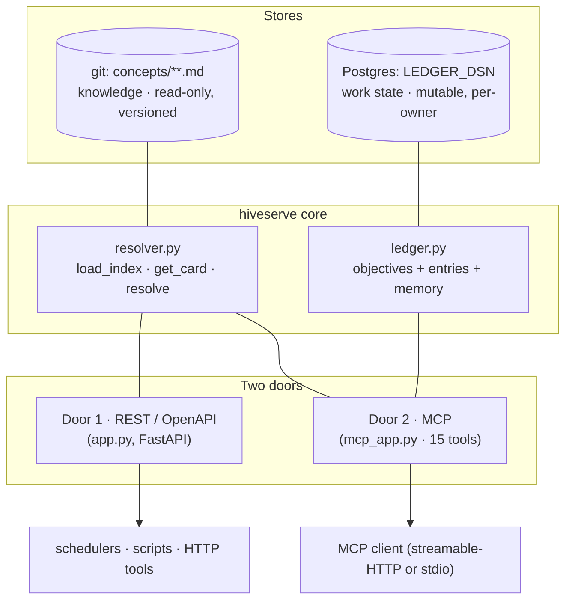

Two transports, one codebase: `serve --stdio` runs MCP over stdio; `serve --http` serves the REST
routes **and** a mounted MCP streamable-HTTP app from one FastAPI process.

**Door 1, REST.** Read-only. Auto-generated OpenAPI at `/docs`.

| Method | Path | Returns |
|---|---|---|
| `GET` | `/healthz` | liveness. **Does not check the corpus** |
| `GET` | `/metrics` | Prometheus exposition |
| `GET` | `/concepts` | the lean index: ids, titles, products, types |
| `GET` | `/find_concepts` | ranked keyword search over that index |
| `GET` | `/card/{card_id}` | one card's markdown |
| `POST` | `/resolve` | a bundle of cards, neighbours, **and any active corrections** |

**Door 2, MCP.** **15 tools and no prompts.** Behaviour lives in skills that travel with the
client, not in the connector: a connector should offer *capabilities*, while *when to investigate
versus plan versus teach* belongs with the agent.

| Group | Tools |
|---|---|
| Retrieval | `list_concepts`, `find_concepts`, `get_card`, `resolve` |
| Database objects | `find_db_objects` |
| Work ledger | `start_objective`, `list_objectives`, `get_objective`, `append_entry`, `set_status`, `record_quiz_result` |
| Personal memory | `remember`, `recall`, `forget`, `promote` |

`find_db_objects` is **LLM-free**, the same shape as `recall`: case-insensitive token matching over
each product's `db/manifest.jsonl`, ranked by hits, filterable by kind or module. Find an object by
name, or by what it means through its verbatim `COMMENT ON` text, then read the exact schema.

> **`/healthz` does not check the corpus.** A service with a stale or empty mount answers
> `{"ok":true}` while serving nothing. Alert on the card-count gauge; see
> [metrics](../reference/metrics.md).

### The skills

The behaviour that used to live as connector prompts now ships as **skills** in `skills/`,
installed through a plugin. A skill is auto-selected from the user's intent and carries the
standing rules: ground every claim in a card's `sources:`, respect isolation, track work in the
ledger.

| Skill | Auto-engages on | What it does |
|---|---|---|
| `hive` (base) | any product question | grounds every answer in cards, cites sources, reaches for tools proactively, honours isolation |
| `diagnose-an-issue` | a live ticket, "why did X fail" | client cards **first**, then baseline product cards, then prior issues; separates client-modified from vanilla behaviour |
| `plan-an-implementation` | "help me set up / redesign X" | grounds a change in concept and client cards; offers a test-plan or spec artifact |
| `learn-a-topic` | *only* an explicit "teach me X" | a tracked, quiz-based curriculum that **resumes** across sessions via the ledger |
| `contribute` | "this card is wrong", "remember this" | interviews, then files through `hive-author` |

A one-off "explain X" stays on the base skill. No learning plan.

### The work ledger

One Postgres database, named by `LEDGER_DSN`. It holds **per-owner state**, never canonical
knowledge, and it is the only thing here that is not a file in git. See
[the ledger](../reference/hive-serve.md#the-ledger) for the storage contract and why it is not a
file.

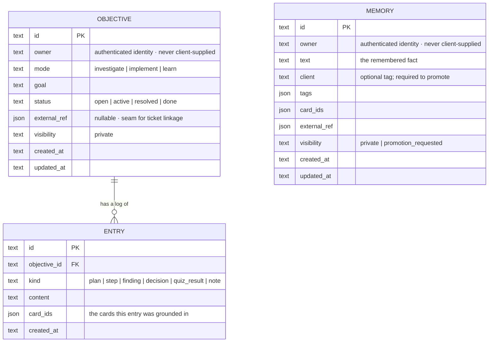

**Identity and owner-scoping.** The app is auth-agnostic. It reads the caller's identity from a
**trusted header injected by the gate** and keys every row on it as `owner`; for stdio it falls
back to a configured default. `owner` is **always** derived server-side, **never a tool
parameter**, so one person can never read or write another's objectives or memory.

### A session in motion

The **diagnose** skill sets the behaviour, the agent is the loop, and the layer retrieves and records:

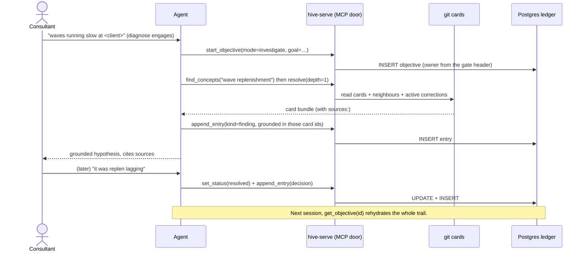

Module-level detail: [hive-serve reference](../reference/hive-serve.md).

## The two stores

A simple way to hold the whole system in mind:

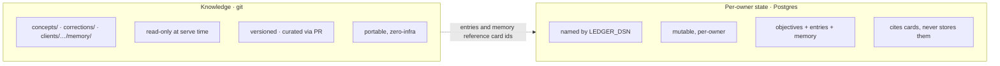

Knowledge is *what is true*. Per-owner state is *what a person is doing and privately knows*. They
touch only through **citations**: an entry records the `card_ids` it relates to.

Blow away the ledger and you lose work history and private notes, not knowledge. The git cards are
untouched.

The one bridge from private to shared is **promotion**: a sanitised, human-approved personal note
becomes a client-scoped memory card in git.

## End to end, one thread

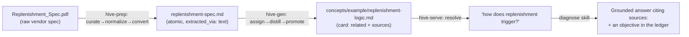

1. **Prep.** The raw PDF is curated (kept, labelled `functional-flow`), normalized, and converted
   to clean atomic markdown with frontmatter.
2. **Create.** `hive-gen` proposes a concept, assigns this document and its siblings to it, and
   distils a card, cross-linked to its neighbours and citing the atomic source. After review it is
   promoted.
3. **Serve.** A consultant asks the agent. The skill engages, calls `resolve`, reads the card and its
   neighbours plus any active corrections, and answers **citing the card's `sources:`**. Findings
   are logged to the ledger, so the investigation resumes later.

No vector database, no re-embedding, no external index. Git files and an agent, with a thin
relational memory beside them.

## See also

- [Architecture](architecture.md), the short version
- [Cards](cards.md), the OKF format in detail
- [Principles](principles.md), the decisions that constrain everything
- [Building a corpus](../guides/building-a-corpus.md), the operator's path through stages 1 and 2
