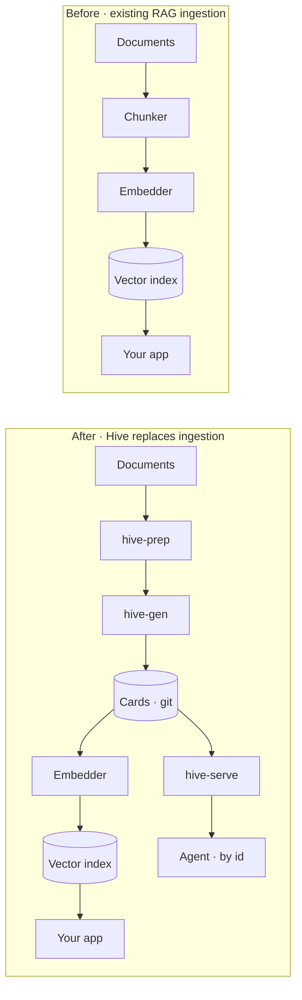

# Using Hive alongside an existing RAG system

Hive is usually described as an alternative to **retrieval-augmented generation (RAG)**. It is also
useful as a stage *in front of* one, and that is often the cheaper way to adopt it.

If you already run a RAG system that underperforms, you do not have to replace it. Most of the time
the problem is not the part you would replace.

## The failure that is usually misdiagnosed

When a RAG system gives bad answers, the reflex is to improve ranking: add a reranker, tune the
embedding model, widen the retrieval window.

Here is a measured baseline over 40 labelled questions against a live corpus of vendor
documentation. Retrieval was semantic; the reranker was `qwen3-reranker-8b`.

| Metric | Baseline | With reranker | Change |
|---|---|---|---|
| hit-rate@8 | 0.625 | 0.625 | **0.000** |
| MRR | 0.384 | 0.406 | +0.022 |
| Mean context relevance | 0.613 | 0.588 | **−0.025** |

Nine questions improved, nine worsened, **zero hits gained or lost.** The reranker reorders what was
already retrieved. It cannot reach what was not.

The recall diagnostic explains why:

| k | hit@k |
|---|---|
| 1 | 0.250 |
| 5 | 0.600 |
| 8 | 0.650 |
| 20 | 0.725 |
| 30 | 0.725 (plateau) |

**11 of 40 expected documents, 27.5%, were never retrieved at all**, even in the top 30. The curve
plateaus at k=20, so a wider window does not help either. Only three documents were recoverable by
better ranking.

The conclusion was blunt: **the gap is recall, not ranking.** And the eleven unreachable documents
were disproportionately spreadsheets, slide decks, tables inside documents, and image-heavy PDFs.
That is not a retrieval problem. It is a **corpus problem**, and it happened upstream of anything a
ranker can influence.

One measurement on one corpus is not a law of nature. But the diagnostic is cheap, and running it
before buying a reranker is almost always worth an afternoon.

## Why a curated corpus retrieves better

RAG quality is bounded by what went into the index. Four things routinely go in badly.

**Chunk boundaries are accidents.** A chunker splits on token count or headings, not on where one
idea ends. A concept split across two chunks embeds as two partial ideas, and neither vector is a
good match for a question about the whole.

**Boilerplate dilutes every vector.** Copyright lines, page footers and confidentiality notices are
in every chunk of every document. They contribute nothing and they pull embeddings toward each
other, which flattens the distinctions ranking depends on.

**Duplicates split the signal.** The same document under three filenames means three near-identical
regions of vector space competing, and none of them decisively winning.

**Structured formats convert badly.** A table flattened into prose, or a slide reduced to its title,
produces text that no longer says what the original said. This was the dominant cause above.

Hive addresses all four before anything is embedded:

| Hive stage | What it fixes |
|---|---|
| `hive-prep` scan and dedup | duplicates, format variants of the same document |
| `hive-prep` transform | tables, slides and image-heavy pages, via a document converter and a vision model |
| `hive-prep` stripper | boilerplate, anchored to footer and header form |
| `hive-gen` distillation | one concept per file, so **a card is already a chunk** |

That last row is the important one. You are not chunking a card. A card is a single reviewed
concept with a title, a description and its own provenance. Embedding it produces a vector that
means one thing.

## What Hive does not do

Stated plainly so nobody wires it in expecting the wrong thing.

Hive has **no embedding model, no vector store and no similarity search**. It is not a RAG system
and does not become one. If you point it at your documents and expect semantic search, you will be
disappointed.

Nor does it fix a RAG system by itself. It produces a better corpus. Somebody still has to curate
it, and that is genuine work: a model drafts at every stage, but a person reviews at three gates.
If nobody will do that, this will not help you.

## Wiring it in

Hive replaces your ingestion, not your retrieval.

Cards are plain markdown with YAML frontmatter, so any pipeline that reads a directory of markdown
can consume them. One file, one chunk, no splitting.

Two things you get for free by doing it this way.

**Facets become hard filters.** Frontmatter carries `product`, `platform` and `version`.
Similarity search cannot guarantee a boundary, because a vector index has no notion of "must not".
A metadata filter can constrain retrieval. For client metadata, follow [the path-derived scope
contract](../reference/hive-serve.md#the-resolver) rather than trusting a frontmatter claim, and keep
[retrieval context distinct from authorization](serving-cards.md#identity-and-what-it-is-not).

**Corrections work without re-ingesting.** When a card goes stale, a correction card overlays it
rather than editing it. Re-embed one card, not the corpus, and keep the audit trail of what changed
and when.

You can also run both retrieval paths against the same corpus: your vector index for open-ended
questions, and `hive-serve` for resolution by id with corrections attached. They are not exclusive.

## Is this your problem? A diagnostic

Before changing anything, measure. This costs an afternoon and it tells you whether the rest of the
page applies to you.

1. **Build a labelled set.** Forty real questions, each with the document that should answer it. Not
   generated questions. Real ones, from real users.
2. **Measure hit@k for k in 1, 5, 8, 20, 30.** Deterministic, no judge model needed. Just: is the
   expected document anywhere in the top k?
3. **Read the curve.**

| What you see | What it means |
|---|---|
| Plateaus well below 1.0 | **Recall ceiling.** Those documents are unreachable. Ranking cannot help. Fix ingestion |
| Climbs steadily to near 1.0 by k=30 | **Ranking problem.** A reranker may genuinely help you |
| High at k=1 already | Retrieval is fine. Your problem is elsewhere, probably in the prompt or the generation step |

The first row is the common one, and it is the one where a reranker is sold and does nothing.

Hive ships the harness for this under `tooling/hive-serve` (`run_eval`). The question sets are
corpus-specific and live with your corpus, not with the tool.

## Which mode is right for you

| | Hive as the system | Hive in front of RAG |
|---|---|---|
| You have | no working retrieval yet | a RAG system that underperforms |
| Change to your stack | replaces it | replaces ingestion only |
| Retrieval style | id and keyword, deterministic | semantic, as now |
| Best when | correctness matters more than coverage | coverage matters and the corpus is the bottleneck |

They are not exclusive, and starting with the second is a smaller commitment. If curated cards
improve your existing system's recall, you have an evidence-backed reason to go further. If they do
not, you have learned that cheaply.
