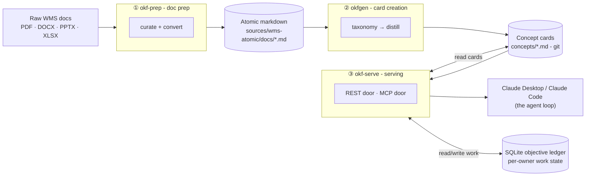
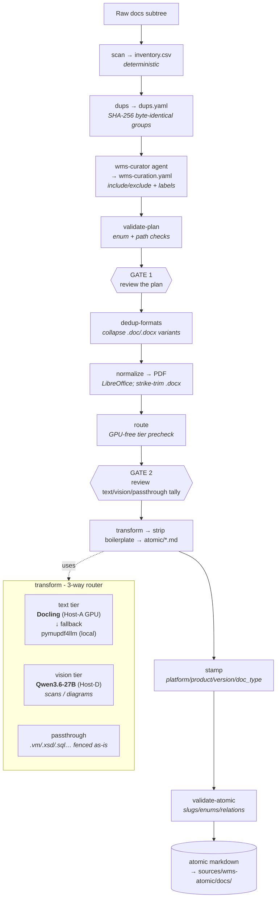
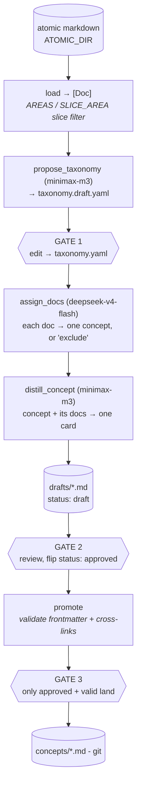
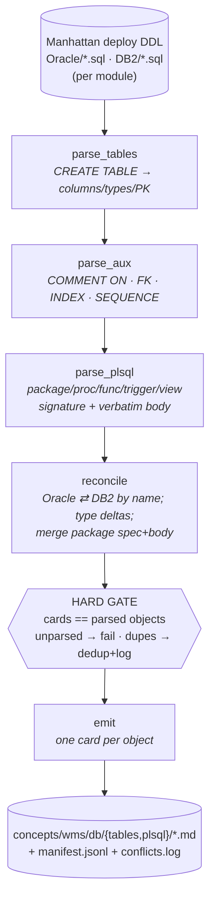
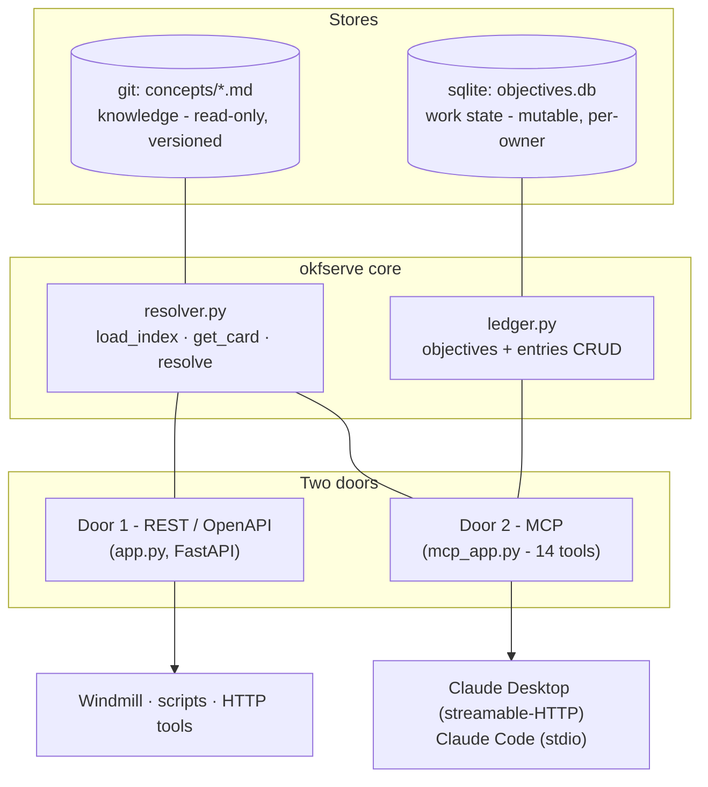
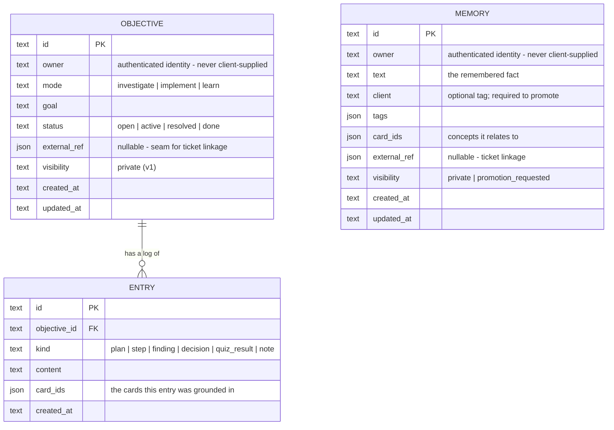
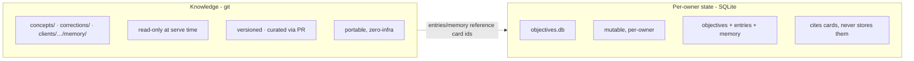
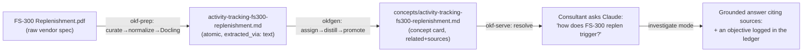
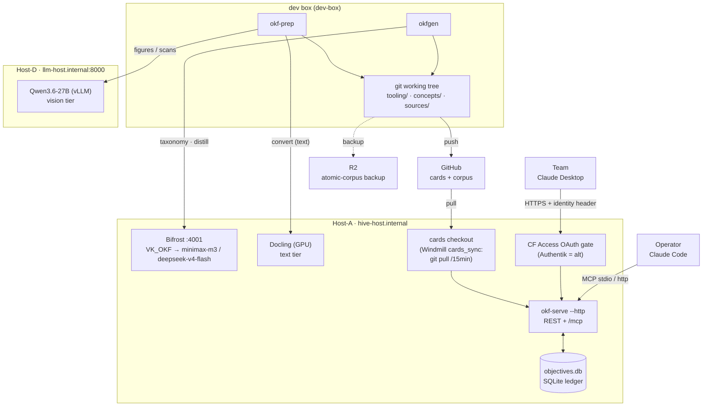

# OKF - Architecture & Concepts

*For anyone who needs to understand how OKF works, end to end - from a raw vendor document to a
grounded answer inside Claude. This is the conceptual reference: the model, the pipeline, the
serving layer, and the design decisions behind them. Diagrams are [Mermaid](https://mermaid.js.org/)
and render inline on GitHub.*

**OKF docs:** [Overview](../README.md) · **Architecture & Concepts** (you are here) · [Guide: Prepare a corpus](runbooks/wms-prep-e2e.md) · [Tooling reference](tooling/README.md) · [Operations: Deploy](../tooling/okf-serve/deploy/README.md)

> **At a glance.** OKF covers four products - WMOS (832), oSCI (60), Slotting (34), and Labour
> Management (64) = **990 concept cards**, plus a **corrections overlay** (991 total). Cards are
> namespaced into per-product folders with path-ids (`concepts/<product>/<id>.md`); a post-promote
> step (facets, conformance, index) sits between card creation and serving; a product-isolation eval
> gates every deploy; a corrections layer overlays outdated cards without editing them; and a
> **memory layer** adds per-owner private notes plus hard-isolated **client-scoped memory cards**
> (`clients/<client>/memory/`). Alongside the narrative cards, a **database-object tier** - 3,027 WMOS
> schema cards (tables + PL/SQL) parsed **deterministically** from the Manhattan deploy scripts - is
> served **on-demand** behind a dedicated `find_db_objects` tool, deliberately kept out of the concept
> index. Claude reaches all of this through a **Cowork plugin** whose skills (base OKF grounding +
> Diagnose / Plan / Learn) replaced the old MCP mode-prompts. Each of these is covered below.

---

## Contents

1. [The big picture](#1-the-big-picture)
2. [Design principles](#2-design-principles)
3. [Stage 1: Document preparation (`okf-prep`)](#3-stage-1-document-preparation-okf-prep)
4. [Stage 2: Card creation (`okfgen`)](#4-stage-2-card-creation-okfgen)
5. [Stage 3: Serving (`okf-serve`)](#5-stage-3-serving-okf-serve)
6. [The two stores: knowledge vs. work state](#6-the-two-stores-knowledge-vs-work-state)
7. [End-to-end walkthrough](#7-end-to-end-walkthrough)
8. [Complete file map](#8-complete-file-map)
9. [Running it](#9-running-it)
10. [Glossary](#10-glossary)

---

## 1. The big picture

OKF turns a pile of raw Manhattan **WMS** (Warehouse Management System) documentation into a
**curated, cross-linked knowledge base of atomic "concept cards" in git**, and serves those
cards to the team through **Claude** - with a per-person **stateful work ledger** underneath.
It is deliberately **small, simple, and sovereign**: it runs on the firm's own hardware, uses
git as its system of record, and adds exactly one piece of new infrastructure (a single SQLite
file) to the serving layer.

There are **three subsystems**, each a self-contained Python package under `tooling/`, chained
into one pipeline:



- **`okf-prep`** ([Stage 1](#3-stage-1-document-preparation-okf-prep)) - a human-gated,
  LLM-assisted pipeline that curates and converts raw docs into **atomic markdown** (one clean,
  single-topic file per source, with metadata frontmatter).
- **`okfgen`** ([Stage 2](#4-stage-2-card-creation-okfgen)) - distills that atomic markdown
  into **concept cards**: a proposed *taxonomy* of concepts, then one reusable card per concept,
  cross-linked into a graph. Cards live in `concepts/` and are versioned in git.
- **`okf-serve`** ([Stage 3](#5-stage-3-serving-okf-serve)) - serves
  the cards through two "doors" (a REST/OpenAPI API and an **MCP** connector for Claude), over a
  **stateful objective ledger** in SQLite that tracks each person's investigations, implementation
  work, and learning.

**The whole thing is LLM-free at serving time** - Claude (the team's Claude Desktop subscription,
and the operator's Claude Code) *is* the reasoning loop. The only server-side model calls happen
during content creation (Stages 1 and 2), on the firm's own gateway.

---

## 2. Design principles

The whole system is built on these core decisions:

| Principle | What it means in practice |
|---|---|
| **Sovereign** | Everything runs on the firm's hardware (Host-A/Host-D) via a local model gateway (Bifrost) and a self-hosted converter (Docling) + VLM (Qwen). No SaaS knowledge product, no external index. |
| **Git is the system of record** | Cards are plain markdown files. Curation gates = PR / diff / review. Zero-infra, portable, auditable. |
| **LLM proposes, human disposes, git records** | Every model stage writes a *reviewable artifact* and stops at a gate; nothing reaches the canonical corpus without a human flip. |
| **LLM-free serving** | The serving layer calls no model. Claude is the loop; the layer just retrieves cards and records work state. |
| **Two clean stores** | *Knowledge* (cards) is read-only, versioned git. *Work state* (the ledger) is mutable per-person SQLite. Never mixed. |
| **Small & recoverable** | One new piece of infra (a SQLite file). Fakes-only tests. Pipelines degrade gracefully (e.g. conversion runs GPU-free if the VLM is down). |

---

## 3. Stage 1: Document preparation (`okf-prep`)

**Goal:** take a folder of raw, messy vendor docs and produce **atomic markdown** - one clean,
single-topic file per source document, labeled with metadata - that Stage 2 can distill.

**Package:** `tooling/okf-prep/` (package `okfprep`, CLI `okfprep`). Orchestrated end-to-end by
the [`/wms-prep`](../.claude/commands/wms-prep.md) command; the operational runbook is
[`docs/runbooks/wms-prep-e2e.md`](runbooks/wms-prep-e2e.md).

**The pipeline, short form:** `scan → dups → wms-curator → validate-plan → ⟨gate 1⟩ → dedup →
normalize → route → ⟨gate 2⟩ → transform → stamp → validate-atomic`. That's what "end-to-end" (e2e)
means - the [flow diagram](#the-flow) and the [runbook](runbooks/wms-prep-e2e.md) walk each step in detail.

### The flow

The governing idea: **put the intelligence up front in one reviewable file, then let
deterministic code do the rest.** A single LLM "curation" pass decides *what to keep and how to
label it*; everything after is repeatable code. There are **two review gates** () where a human
must approve.



**Three kinds of actor**, and it helps to know which is which:

| Actor | Good at | Where |
|---|---|---|
| **LLM** (Claude / the `wms-curator` agent) | judgment, reading content | **curate** (what to keep + how to label) |
| **Deterministic code** | repeatable, free | scan, dups, validate, dedup, normalize, transform, stamp |
| **You** | approval, accountability | the two review gates |

### The converter, in detail

`transform.py` profiles each normalized PDF (average characters/page, image-dominance) and
**routes** it:

- **text-rich** → the **text tier**: send the file to **Docling** on Host-A (best tables/layout),
  and *fall back to local `pymupdf4llm`* on any Docling failure - so the pipeline still runs with
  no GPU.
- **image-dominant** (a scan or a screenshot-heavy deck) → the **vision tier**: render each page
  and describe it with **Qwen3.6-27B** on Host-D (an OpenAI-compatible VLM). The WMS corpus is almost
  entirely born-digital, so the vision tier is the fallback for scanned or image-heavy material.
- **already-text formats** (`.vm/.xsd/.xml/.json/.sql/.properties`) → **passthrough**: fenced into
  markdown as-is.

Immediately before an atomic file is written, the converted markdown from the **text and vision
tiers** (never passthrough - you don't regex-scrub fenced code) is passed through the
**boilerplate stripper** (`stripper.py`): product-tunable YAML rules that remove copyright,
trademark notices, "all rights reserved", confidentiality lines, "Page X of Y" footers, and
table-of-contents dot-leaders. Rules are scoped to footer/header *form* so they can't delete real
prose, and the whole step is toggleable (`strip_boilerplate` / `strip_product`). This is separate
from `striptrim.py`, which removes strikethrough/tracked-change text earlier, at the `.docx` level
inside `normalize`.

Every atomic file gets frontmatter recording how it was made:

```yaml
---
title: "SCPP_Architecture"
slug: wms-scpp-architecture
topic: WMOS platform architecture
doc_type: technical-spec        # a closed vocabulary (validated)
version: unknown
product: WMS
platform: SCPP
source_doc: "SCPP_Architecture.pptx"
extracted_via: text             # text | vision | passthrough
status: active
---
```

### `okf-prep` file map

| File | Job |
|---|---|
| `cli.py` | The `okfprep` command group: `scan · dups · validate-plan · dedup-formats · normalize · route · transform · stamp · validate-atomic`. Builds the model clients from `.env` for `transform` only. |
| `config.py` | Env/`.env`-backed settings: corpus/work/atomic dirs, Docling + Qwen endpoints, routing thresholds. Model backends are **config-injected**, never hardcoded. |
| `scanner.py` | Walks a directory tree → an inventory CSV (path, size, type, folder-derived hints). |
| `folder_parser.py` | Parses folder names into classification hints (product/version/category priors). |
| `dups.py` | SHA-256 groups byte-identical files so the curator keeps one copy. |
| `curation_plan.py` | Loads + deterministically validates `wms-curation.yaml`; family-aware `.doc/.docx` variant dedup. |
| `slugs.py` | Slug helpers (`PASSTHROUGH_EXTS`, `slugify`, `assign_slugs`) - stable, de-collided slugs. |
| `libreoffice.py` | Converts office formats → PDF via headless LibreOffice. |
| `striptrim.py` | Removes struck-through / tracked-change text from a `.docx` before conversion. |
| `normalize.py` | Source doc → PDF intermediate (strike-trim `.docx`, LibreOffice the rest, copy PDFs). |
| `docling_client.py` | HTTP client for the **Docling** converter on Host-A (bytes → markdown). |
| `vision.py` | HTTP client for **Qwen3.6-27B** on Host-D (page image → markdown; describes figures). |
| `transform.py` | The 3-way router (text/vision/passthrough) + PDF profiling; runs the boilerplate stripper on text/vision output; writes atomic markdown with `extracted_via` frontmatter. |
| `stripper.py` (+ `stripper_rules/*.yaml`) | Scrubs copyright/trademark/confidentiality/page-number boilerplate from converted markdown via product-tunable, footer-scoped regex rules. |
| `stamp.py` | Fills invariant frontmatter (`platform/product/version/doc_type/topic`) from the curation plan. |
| `validate.py` | Validates the atomic corpus (unique slugs, `doc_type` enum, resolvable links) → derives `relations.yaml`. |

**Deep dive:** [`tooling/okf-prep.md`](tooling/okf-prep.md) - every module's logic, inputs/outputs, and how it's invoked.

**The `wms-curator` agent** ([`.claude/agents/wms-curator.md`](../.claude/agents/wms-curator.md))
is the one judgment step: it reads the inventory + dups, spot-reads ambiguous files, and writes
`wms-curation.yaml` (include/exclude + content-derived labels). It never modifies source docs.

---

## 4. Stage 2: Card creation (`okfgen`)

**Goal:** distill the atomic markdown into **concept cards** - reusable, cross-linked knowledge,
one card per concept.

**Package:** `tooling/okf-gen/` (package `okfgen`). It is **concept-centric** and, like `okf-prep`,
**gate-aware**: it does one stage, writes a reviewable artifact, and stops.

### The flow (3 gates)



- **Load** (`load.py`) reads atomic markdown into a source-agnostic `Doc {id, name, text}`. The
  **slice lever** is the `AREAS` registry + the `SLICE_AREA` env var: distillation runs one functional
  *area* at a time (topic → area map), so the corpus is built area-by-area and product-by-product rather
  than all at once. All four products - WMOS, oSCI, Slotting, Labour Management - are distilled this way;
  **990 concept cards** live across `concepts/<product>/`.
- **Taxonomy** (`taxonomy.py`) asks the model for a fine-grained list of concepts → `taxonomy.yaml`
  (Gate 1: you curate *what concepts exist*).
- **Assign** (`assign.py`) classifies each doc into exactly one concept, or `exclude`.
- **Distill** (`card.py`) concatenates a concept's assigned docs and produces `{title, description,
  tags, related, body}` - the `related` ids are constrained to the real taxonomy so links can't be
  hallucinated. Output lands in `drafts/` as `status: draft` (Gate 2: you review and flip to
  `approved`).
- **Promote** (`promote.py`) validates required frontmatter and that every `related:` id resolves,
  then moves valid, approved drafts into `concepts/` (Gate 3).

Models run on the firm's **Bifrost** gateway via the `VK_OKF` virtual key (taxonomy/distill =
`minimax-m3`, assign = `deepseek-v4-flash`).

### The card, anatomy

A concept card is markdown with frontmatter + curated prose. The frontmatter makes it a node in a
graph (`related:` links + `sources:` provenance):

```yaml
---
type: concept
title: 2013 Replenishment Logic - Excess Wave Need Processing
description: Manhattan WMOS replenishment logic for moving inventory…
tags: [replenishment, wave, pick-location]
resource: https://hive.example.com/card/wms/base-replenishment-logic   # served-card URI
sources:
  - kind: wms-doc
    ref: wms-wmos-…-2013-replenishment-logic.md   # traces back to the atomic source
related:
  - wms/shipping-wave-replenishment-subprocess      # path-id edges into the concept graph
  - wms/replenishment-process-flow
distilled_at: '2026-06-30'
timestamp: '2026-06-30'          # OKF-recommended last-change field
status: approved
product: wms                     # facets: selection + isolation (product/platform/version/regime)
platform: wmos
version: ['2018', '2020']
---

## Overview
…self-contained, reusable prose (the bulk of the value)…

## Related
- [Shipping Wave Replenishment Subprocess](/wms/shipping-wave-replenishment-subprocess.md)
- [Replenishment Process Flow](/wms/replenishment-process-flow.md)

# Citations
1. `wms-wmos-…-2013-replenishment-logic.md`
```

The card lives at **`concepts/<product>/<id>.md`** and its **concept ID is that path** (`wms/base-replenishment-logic`) - the OKF-spec identity model. `## Related` (bundle-relative markdown links, regenerated from `related:`) and `# Citations` (from `sources:`) make the graph and provenance visible to any OKF consumer, not just okf-serve. The `product`/`platform`/`version`/`regime` facets drive selection + cross-product/regime isolation.

### `okfgen` file map

| File | Job |
|---|---|
| `load.py` | Read atomic markdown (local) or R2 into `Doc`s; the `AREAS`/`SLICE_AREA` slice filter (source-aware). |
| `taxonomy.py` | Propose a per-area concept taxonomy from the doc inventory (LLM) → `taxonomy.<area>.yaml`. |
| `assign.py` | Classify each doc into exactly one concept id, or `exclude`. |
| `card.py` | Distill a concept + its assigned docs → one OKF card (frontmatter + prose); constrains `related` to real ids. |
| `promote.py` | Validate frontmatter + cross-links; move approved drafts → `concepts/<product>/`. |
| `facets.py` | Idempotent stamp/read of the `product`/`platform`/`version`/`regime` facets; cross-facet lint. |
| `classify_regime.py` | LLM regime proposer (ops vs. traditional), human-gated, fail-safe - the batch classifier kept for future automation. |
| `retopic.py` | Re-map/merge concepts across a taxonomy revision (area re-slicing without a full re-distill). |
| `corrections.py` | The pure `record ⇄ correction-card` serialization seam - feeds both the CLI and the GitHub Action. |
| `memory.py` | The pure `record ⇄ memory-card` serialization seam - feeds the CLI, the Action, and okf-author. |
| `run.py` | Gate-aware orchestrator + entrypoint (taxonomy → assign+distill → drafts), area-scoped via `SLICE_AREA`. |
| `llm.py` | `BifrostChat` (OpenAI-compatible client, bounded retry) + `extract_json` (strips `<think>` reasoning, pulls JSON). |
| `config.py` | Settings: source (`ATOMIC_DIR` wins, else R2), Bifrost base/key, the three model slots, timeouts. |

**Deep dive:** [`tooling/okf-gen.md`](tooling/okf-gen.md) - the 13 modules and 16 scripts (`scripts/`) in module-level detail.

### Post-promote - facets, conformance & index (the "Stage 5" run-order step)

Promote (gate 3) lands cards in `concepts/<product>/`, but they are not *servable-ready* until three
deterministic, **idempotent, LLM-free** scripts run over the whole `concepts/` dir. This is a
first-class pipeline step - run it after every distillation, for any product:

| Step | Script | What it does |
|---|---|---|
| **1. Facet stamp** | `okf-gen/scripts/product_facet_apply.py <concepts> <atomic> <product> <platform>` (oSCI uses `osci_facet_apply.py`) | Stamps `product` + `platform` + `version` (union of the card's source-doc folder-years) onto the product's cards. |
| **1b. Version facet** | `okf-gen/scripts/version_apply.py <concepts>` | Deterministically derives `version` (release scope) from source-ref years - no LLM, no gate. Soft filter-with-fallback (no `resolve()` guard). |
| **1c. Regime facet** | `okf-gen/scripts/regime_apply.py <concepts>` (proposals from `regime_classify.py`) | Stamps `regime` (ops vs. traditional, within-product either-or) from a human-reviewed classification; drives the cross-regime `resolve()` expansion guard. |
| **2. Conformance pass** | `okf-gen/scripts/conformance_pass.py <concepts>` | Sets `resource` → served-card URI; adds the OKF-recommended `timestamp`; regenerates `## Related` (bundle-relative markdown links, from `related:`) and `# Citations` (from `sources:`) body sections. |
| **3. Index generation** | `okf-gen/scripts/index_generate.py <concepts>` | Writes the root `index.md` (`okf_version: "0.1"` frontmatter) + per-product `index.md` progressive-disclosure listings (concepts only - corrections excluded). |

(The facet scripts are all **idempotent + LLM-free**; `version`/`regime` are optional per product - a product ships with `product`/`platform` always, `version`/`regime` where the source supports them.)

Why it exists: it takes the corpus from *formally* OKF-conformant (parseable frontmatter + non-empty
`type`) to *idiomatically* conformant - path-id identity, a graph expressed as inline bundle-relative
markdown links, `# Citations`, and a spec-shaped index. The scripts are idempotent, so re-running over
the full corpus leaves already-conformant cards untouched and only transforms new ones. (There is no
official OKF validator yet - `okf-lint` is a v0.0.1 stub - so conformance is checked by an in-repo audit
script against the spec text.)

**Isolation eval = the deploy gate.** Before deploy, `okf-serve/run_eval` over `data/<product>_product_qa.jsonl`
must show **0 cross-product bleed** (plus no regime/version regression). No product ships without it.

### The corrections layer

A concept card can be **wrong or stale** without anyone wanting to edit the distilled prose (it's a
reviewed artifact, and edits lose the "what the source said" provenance). The corrections layer fixes this
with an **overlay**: a *correction* is an ordinary OKF card at `concepts/<product>/corrections/<slug>.md`
with `type: correction` and `corrects: <path-id>` pointing at the concept it amends. To author one, see
[Guide: Correct a concept card](runbooks/okf-correct-a-card.md).

- **Surface-don't-resolve.** `okf-serve`'s `resolve()` reverse-looks-up the **active** corrections
  (`type: correction` **and** `status: approved`) of every selected concept and **co-pulls** them into the
  answer bundle *after* the concept's own BFS/budget - intentionally **unbudgeted** (a correction is never
  dropped, or the wrong fact would stand). The answer prompt treats a correction as **authoritative**.
- **Never selected, never listed.** Corrections are excluded from the selectable index (`list_concepts` +
  the agent selector) and from per-product `index.md` listings - they only ride along with their target.
- **Supersede, don't delete.** A newer correction can `supersedes:` older ones, flipping them to
  `status: superseded` (kept in git for history). Conflicts (>1 active correction on one concept) are a
  **lint warning** for human resolution, not an auto-merge.
- **Authoring: from Claude first, GitHub optional.** The **primary entry is from Claude**, via the
  [`okf-author`](#the-memory-layer) server's `submit_correction` tool, which files an `okf-correction`
  issue. The GitHub **Issue Form → Action** (`.github/ISSUE_TEMPLATE/correction.yml` →
  `.github/workflows/correction-from-issue.yml`, fires on label `okf-correction-approved` → opens a PR)
  and the `scripts/new_correction.py` CLI are **optional power-user paths** into the *same* pure
  `record ⇄ card` seam (`okfgen/corrections.py`). `CODEOWNERS` routes each product's corrections dir to
  the owner;
  `scripts/corrections_lint.py` (+ the `corrections-lint` CI workflow) gates dangling targets, bad
  supersedes, status inconsistency, and conflicts.

| Script / file | Job |
|---|---|
| `okf-gen/okfgen/corrections.py` | Pure `record_to_correction` / `correction_to_record` seam (shared by CLI + Action). |
| `okf-gen/scripts/new_correction.py` | CLI: scaffold a `status: draft` correction card under `concepts/<product>/corrections/`. |
| `okf-gen/scripts/correction_from_issue.py` | Parse a Correction Issue-Form body → record → card (product allowlist-guarded against path traversal). |
| `okf-gen/scripts/corrections_lint.py` | Lint: dangling `corrects`, bad `supersedes`, status inconsistency, >1-active conflict warning. |

Design + acceptance: `docs/superpowers/specs/2026-07-09-okf-corrections-layer-design.md`. Shipped in PR #15;
verified live (a seeded correction on `slotting/data-requirements` co-pulls and overrides at query time).

### The memory layer

Concepts and corrections describe **how the product works**. **Memory** captures **what a practitioner
has learned** - especially **client-specific operational knowledge** ("at ALPHA, allocation confirm
requires a second verification scan"). Memory is a third card `type` (alongside `concept` and
`correction`) and lives in **two tiers**, each in the store that fits it:

- **Personal tier - private, in the work ledger.** An owner jots facts with the `remember` MCP tool;
  they persist as owner-scoped rows in the SQLite ledger (a `memory` table beside `objective`/`entry`),
  are recalled with `recall` (deterministic substring/tag/card/client filter - **no model at serve
  time**), and removed with `forget`. They never enter git and are never visible to another owner.
- **Global tier - shared, client-scoped, in git.** A promoted memory is a `type: memory` card at
  **`clients/<client>/memory/<slug>.md`** with a `client` facet. It is **selectable** (unlike a
  correction) but **hard-isolated**: it surfaces only inside its client's active scope and never bleeds
  into a core answer or another client's answer.

**The invariant.** Memory is client-specific operational knowledge; it lives in a `clients/<client>/`
namespace and **structurally cannot touch `concepts/`**. A lesson that belongs in *core* knowledge is a
correction or a new concept, never a memory - so core product documentation can never be polluted by it.

**Hard isolation (two guards).** The `client` is a query-time scope (the persona determines it, like the
regime), derived structurally from the card's id path - not from author-supplied frontmatter:

- **Selection filter.** With no client set, memory is excluded entirely (`list_concepts()` and the agent
  selector see concepts only - core stays pristine). With `client=alpha`, only ALPHA's memory joins the
  candidate set; another client's memory is never a candidate.
- **BFS guard.** During `resolve()` graph expansion, a neighbour is admitted only if
  `neighbour.client ∈ {None, active_client}` - the same shape as the cross-regime guard, so no client
  memory leaks transitively.

**Promotion - personal → global, sanitize + approve.** `promote(memory_id)` (keyless; okf-serve only
reads *your* row) prepares a neutral promotion record and flips the row to `promotion_requested`; you
sanitise it (strip client names / ticket #s / personal specifics) and it is filed as an **`okf-memory`
Issue** - **primarily from Claude**, through the **`okf-author`** server's `submit_memory_promotion`
tool (the GitHub **Memory Issue Form** is an optional power-user path). A CODEOWNER approve-label fires
the `memory-from-issue` Action, which
builds the card and opens a PR; merging it makes the memory live on the next `cards_sync` pull. The
authoring surface mirrors corrections and shares one **pure `record ⇄ card` seam** (`okfgen/memory.py`).
To capture and promote a memory step by step, see
[Guide: Remember and promote a memory](runbooks/okf-remember-and-promote.md).

**Conflict is a two-layer gate.** When a promoted memory would collide with another for the *same client*
on the *same subject*, `memory_lint` (deterministic) enumerates candidate pairs (shared `related`/tag),
and `memory_conflict_score` (an LLM probability judge, **CI/authoring-side only** - the connector stays
LLM-free) scores each; a genuine conflict **blocks the PR** until a human resolves it (supersede /
reconcile / reject), a spurious overlap passes. The scorer is **fail-safe: any LLM error scores as a
conflict (block)**. Resolution is supersede-don't-delete, and the original author is notified via the
card's `submitted_by` provenance.

**`okf-author` - the write-only door.** So that okf-serve stays **keyless and read-only**, a separate,
minimal MCP server holds the only GitHub credential - scoped to **`issues:write` only** (it can file an
issue, never push, merge, or open a PR - the Action does that after the human approve-label). It exposes
**two hard-separated tools** that structurally cannot cross: `submit_memory_promotion` (requires a
`client`, labels `okf-memory`) and `submit_correction` (targets a core concept id, labels
`okf-correction`). Its issue bodies match the Issue Forms exactly, so the same Action parsers accept them.

| Script / file | Job |
|---|---|
| `okf-gen/okfgen/memory.py` | Pure `record_to_memory` / `memory_to_record` seam (shared by CLI + Action + okf-author). |
| `okf-gen/scripts/new_memory.py` | CLI: scaffold a `status: draft` memory card under `clients/<client>/memory/`. |
| `okf-gen/scripts/memory_from_issue.py` | Parse a Memory Issue-Form body → record → card (product allowlist + `client` `\A[a-z0-9-]+\Z` path guard). |
| `okf-gen/scripts/memory_lint.py` | Structural lint (bad client/product, dangling `related`, bad supersedes, status) + same-client conflict candidates. |
| `okf-gen/scripts/memory_conflict_score.py` | LLM conflict-probability gate over the candidates - fail-safe to block; advisory unless keyed. |
| `okf-author/` (package `okfauthor`) | Write-only MCP server: `submit_memory_promotion` / `submit_correction` (issues:write only). Module-level detail: [`tooling/okf-author.md`](tooling/okf-author.md). |

Design + acceptance: `docs/superpowers/specs/2026-07-11-okf-memory-cards-design.md`. Shipped across
PRs #45-#48 (personal tier → client-scoped serving → authoring/gate → okf-author); okf-serve is live with
memory tools and client isolation verified end-to-end.

### The database-object tier (`okf-dbparse`)

Concept cards describe **how WMOS works**; they do not describe **the data model itself** - the tables,
columns, data types, keys, and stored PL/SQL that a WMOS system actually runs on. The database-object
tier fills that gap with **3,027 precise schema cards** parsed straight from the product's own deploy
DDL - the authoritative source, not prose about it.

**This is a different mechanism from Stages 1-2.** Concept cards are *distilled by an LLM* from messy prose
(judgment, paraphrase). Schema is exact and must stay exact, so the db tier is produced by a **deterministic
parser with no model in the loop** - a one-time ingest whose output is verbatim. The package is
`tooling/okf-dbparse/` (package `okfdbparse`); its parsing engine is **sqlglot** (a
dialect-aware SQL parser - a real tokenizer/AST, never regex, so quirky DDL parses correctly), with
`PyYAML` for the card frontmatter.

**Source.** The Manhattan WMOS deploy scripts ship the schema twice, once per supported DBMS:
`ManhDBDeploy/{Oracle,DB2}/DBScripts/Product/*.sql` (one file per functional **module** - `DOM.sql`,
`CM.sql`, …). The parser reads both dialects and reconciles them per object.



- **`parse_tables`** turns each `CREATE TABLE` into columns (name, Oracle type, DB2 type, nullability),
  the primary key, and inline constraints - degrading gracefully where sqlglot bails on Oracle storage
  clauses (`TABLESPACE`, `USING INDEX`) via a token-level fragment fallback.
- **`parse_aux`** overlays the out-of-line facts: `COMMENT ON TABLE/COLUMN` (kept **verbatim** as the
  human description), foreign keys (`ALTER TABLE … ADD CONSTRAINT … REFERENCES`), indexes, and sequences.
- **`parse_plsql`** captures every programmatic unit - packages, procedures, functions, triggers, views -
  with its **signature/spec and its full body copied verbatim** as a character slice (so nothing is
  paraphrased or normalised). Unit boundaries come from the tokenizer, not line heuristics: a `/` only
  terminates a unit when it stands alone on its line, so a `total / count` division inside a body can't
  truncate it. PL/SQL is captured from **both** the dedicated `PLSQL_Objects/` files **and** inline in the
  module files (most triggers/views live inline - missing them would drop ~1,000 objects).
- **`reconcile`** matches Oracle and DB2 definitions of the same object by name, records per-column/per-body
  **type or body deltas** between dialects, and merges a package spec with its body into one unit.

**The hard verification gate is the point.** `okfdbparse/run.py` refuses to emit a partial corpus: the
card count must equal the parsed-object count, **any unparsed construct fails the run** (this is what
surfaced every real-corpus DDL quirk - `NOT NULL ENABLE`, `GLOBAL TEMPORARY`, `GENERATED … IDENTITY`,
`FORCE` views, DB2 `VARIABLE`/`SEQUENCE`/`SYNONYM`, `CTAS` - until each was handled), and same-name
collisions are deduped when structurally identical and otherwise **logged to `conflicts.log`**, never
silently overwritten. The output is a folder of cards plus a `manifest.jsonl` index the serving layer reads.

**Corpus.** `concepts/wms/db/{tables,plsql}/*.md` = **3,027 cards**: 892 tables, 913 triggers, 841
procedures, 146 functions, 140 views, 95 packages. Every card is `type: dbobject`, carries its `module`
(the source functional area), its `platform` dialects (`oracle`/`db2`), `sources:` (the exact DDL file),
and `related:` edges to referenced tables (from the FKs).

```yaml
# a table card - abridged frontmatter
---
type: dbobject
kind: table
title: A_ALLOC_RULE_SEGEMENT — Table to store the segments selected in an allocation rule.
description: Table to store the segments selected in an allocation rule.   # verbatim COMMENT ON
product: wms
module: DOM
platform: [oracle]
sources: [Oracle/DBScripts/Product/DOM.sql]
related: [wms/db/tables/A_ALLOC_FULFILL_PARAM]   # from a foreign key
---
```

The body then renders the schema itself: a `## Columns` table (Column / Oracle type / DB2 type / Null /
Key / Description), then `## Primary key`, `## Foreign keys`, `## Indexes`, `## Sequences`, and
`## Triggers`. A **PL/SQL card** carries the same frontmatter over a `## Signature / spec` block and
`## Source (Oracle)` / `## Source (DB2)` fenced bodies (a DB2 body identical to Oracle's is recorded as
*"Identical to Oracle."* rather than duplicated).

**On-demand serving, not in the concept index.** This tier is 3× the concept corpus and is schema-level,
not narrative - putting it in `list_concepts` would drown concept retrieval. So the db cards are
**excluded from the selectable index** and reached **only** through the `find_db_objects` tool
(see [§Stage 3 - the database-object door](#the-database-object-door)); the base skill nudges Claude into
that tool for schema questions and stays on concept cards for functional ones.

| File | Job |
|---|---|
| `okfdbparse/model.py` | The dataclasses: `Table` (columns/PK/FK/index/seq/trigger), `Column`, `PlsqlObject` (signature + Oracle/DB2 bodies). |
| `okfdbparse/parse_tables.py` | `CREATE TABLE` → columns/types/PK/inline constraints; token-level fallback for Oracle storage clauses; db2→generic dialect map (**sqlglot has no `db2` dialect**). |
| `okfdbparse/parse_aux.py` | Overlays `COMMENT ON` (verbatim), foreign keys, indexes, sequences. |
| `okfdbparse/parse_plsql.py` | Package/proc/func/trigger/view boundary detection + **verbatim body** slice; standalone-`/` terminator; captures inline + `PLSQL_Objects/` units. |
| `okfdbparse/reconcile.py` | Oracle ⇄ DB2 match-by-name, type/body deltas, package spec+body merge. |
| `okfdbparse/emit.py` | One card (+ `manifest.jsonl` line) per object; deterministic `card_id`; safe-yaml frontmatter. |
| `okfdbparse/run.py` | The CLI + **hard verification gate** (count-match, unparsed→fail, dedup+`conflicts.log`); walks both dialect trees. |

**Deep dive:** [`tooling/okf-dbparse.md`](tooling/okf-dbparse.md) - each parser stage in module-level detail.

Design + plan: `docs/superpowers/{specs,plans}/2026-07-15-okf-wmos-dbobjects*`. Shipped in PR #82 (3,027
cards, gate-verified, 0 unparsed).

---

### The issue-journal tier (`okf-zendesk`)

Concept cards describe how WMOS works; the memory layer describes how *this client's* system was
modified. Neither records **what has actually gone wrong at a site**. The issue-journal tier fills that
gap with one thin `type: issue` card per closed support ticket, under `clients/<client>/issues/`.

**A journal entry is deliberately not a knowledge card.** Distilling each ticket into an explanation
would restate the concept corpus thousands of times and dilute retrieval. An entry carries only what
happened, how it closed, and `related` links to the concept cards that explain the behaviour. Its
purpose is *awareness*: to tell a consultant that this area has bitten this client before. The
Diagnose / Plan / Learn skills state the contract explicitly - an entry is a lead, never a root cause.

Two properties follow from that:

- **Client-scoped, like memory.** Issue cards never appear in an unscoped `list_concepts`, and one
  client's incidents never reach another's answer.
- **Linking is a separate stage from distillation.** The distiller has never seen the corpus, so any
  card id it invents resolves ~4% of the time. Cards are emitted with `related: []` and linked
  afterwards against real ids by a model shown a shortlist and free to decline.

Unlike the db-object tier, this one *does* have a model in the loop, and two different ones: the prose
is distilled on-prem (`host-d/qwen3.6-27b`) while the links are chosen by a hosted model
(`minimax-m3` by default, escalated to `claude-opus-4-8` when precision demands it). Each card records
both in `model:` and `linked_by:`.

**Deep dive:** [`tooling/okf-zendesk.md`](tooling/okf-zendesk.md) - pipeline, modes, model selection,
measured link quality, and the open TODO list.

Design + plan: `docs/superpowers/{specs,plans}/2026-07-19-okf-zendesk-issue-cards*`. Shipped in PR #92
(2,295 entries for ALPHA and BETA; 0 dangling links, 0 cross-product bleed).

---

## 5. Stage 3: Serving (`okf-serve`)

**Goal:** serve the cards to people and tools, and track each person's *work* - without
re-introducing a heavy retrieval stack. Claude is the reasoning loop; this layer is LLM-free.

**Package:** `tooling/okf-serve/` (package `okfserve`, CLI `okfserve`).

### One core, two doors, two stores



Two transports, one codebase (`server.py`): `okfserve serve --stdio` runs the MCP server over
stdio (the operator's Claude Code); `okfserve serve --http` serves the REST routes **and** a
mounted MCP streamable-HTTP app from one FastAPI process (the team, behind the Cloudflare Access gate).

### Door 1 - REST / OpenAPI (`app.py`)

The universal HTTP face (auto-generated OpenAPI at `/docs`). Read-only in v1.

| Method | Path | Returns |
|---|---|---|
| `GET` | `/healthz` | liveness |
| `GET` | `/concepts` | the card index `[{id, title, description}]` |
| `GET` | `/card/{id}` | one card's markdown (404 if missing) |
| `POST`| `/resolve` | `{ids, depth}` → a bundle of cards + their cross-linked neighbours, **plus any active corrections** of the selected concepts (co-pulled, authoritative) |

### Door 2 - MCP (`mcp_app.py`)

The connector Claude speaks. It exposes **14 tools** and **no prompts** - the three persona prompts
that used to live here were **retired in PR #81**; the personas now ship as
[Cowork plugin skills](#the-personas-a-cowork-plugin). A connector should offer *capabilities* (tools);
*behaviour* (when to investigate vs. plan vs. teach) belongs in skills that travel with the client.

- **Read tools** (wrap the resolver): `list_concepts`, `get_card`, `resolve` - `list_concepts` and
  `resolve` take an optional `client` scope that gates client memory (hard-isolated; no client → concepts
  only).
- **The database-object door**: `find_db_objects` - the only path to the on-demand
  [database-object tier](#the-database-object-tier-okf-dbparse). See below.
- **Ledger tools** (the stateful part): `start_objective`, `list_objectives`, `get_objective`,
  `append_entry`, `set_status`, `record_quiz_result`.
- **Memory tools** (the personal tier): `remember`, `recall`, `forget`, `promote` - owner-scoped private
  notes; `promote` prepares a note for [promotion to a shared client memory](#the-memory-layer).

<a id="the-database-object-door"></a>
**`find_db_objects(query, kind?, module?, limit?)` - the database-object door.** The
[database-object cards](#the-database-object-tier-okf-dbparse) are kept out of `list_concepts` (they'd
swamp concept retrieval), so this tool is the way in. It is **LLM-free** - the same shape as memory
`recall`: case-insensitive token/substring matching over each product's `concepts/<product>/db/manifest.jsonl`
(the parser's index of `{id, kind, module, title, description, tags}`), ranked by hits, optionally filtered
by `kind` (table/package/procedure/function/trigger/view) or `module`. It returns lightweight rows
`{id, kind, module, product, title, description}`; Claude then loads the ones it wants with `resolve`/`get_card`
like any card. Find an object **by name** (`ALLOCATION`) or **by what it means** (the object's verbatim
`COMMENT ON` text - e.g. `"staging inbound"`), then read the exact schema.

<a id="the-personas-a-cowork-plugin"></a>
**The personas - now a Cowork plugin (skills).** The `investigate` / `implementation_advisor` /
`guided_learning` mode-prompts were removed from the connector and reborn as **skills** in a Cowork plugin
(`example-org/voyagerforge-plugins`, plugin `okf`). A skill is auto-selected by Claude from the
user's intent - no slash-command needed - and carries the standing rules the prompts used to
(*ground every claim in a card's `sources:`*, *respect regime/product/client isolation*, *track work in the
ledger*). The plugin also **bundles the connector** (`.mcp.json` → `https://hive.example.com/mcp`), so
one install gives a user both the tools and the behaviour:

| Skill | Auto-engages on | What it does |
|---|---|---|
| **`okf`** (base, always-on) | any WMOS/SCALE question, and general Q&A | Grounds every answer in cards, cites `sources:`, reaches for the tools proactively, honours isolation. Also nudges into `find_db_objects` for schema questions. |
| **Diagnose an Issue** | a live/production ticket or "why did X fail/not allocate" | Client cards **first** (via `resolve` with the client) → baseline product cards → prior issues; separates client-modified vs. vanilla behaviour. |
| **Plan an Implementation** | "help me set up / redesign / configure X", "write a test plan" | Grounds a build/change in concept + client cards; offers a test-plan / spec artifact; can turn a known root cause into a fix plan. |
| **Learn a Topic** | *only* an explicit "I want to learn / train me on X" | A tracked, quiz-based curriculum over the card graph that **resumes** across sessions via the ledger. A one-off "explain X" stays on base OKF - no learning plan. |

Diagnose/Plan/Learn optionally open a ledger objective (`start_objective`) for multi-session work; a plain
explanation does not. Full skill bodies, the manifest set (`marketplace.json` / `plugin.json` / `.mcp.json`),
install steps, and a six-scenario behavioural eval live in the plugin repo's
[`plugins/okf/README.md`](https://github.com/example-org/voyagerforge-plugins); design +
acceptance: `docs/superpowers/specs/2026-07-15-okf-cowork-plugin-design.md` (PR #81).

### The stateful store - the SQLite objective ledger (`ledger.py`)

The one new piece of infrastructure: a single SQLite file at `OKF_DATA_DIR/objectives.db`
(WAL mode). It holds **per-owner state**, never canonical knowledge - the trail of *work* (objectives +
entries, citing cards) and the owner's *private memory* notes. Objectives share **one** abstraction:
an *objective* with a log of *entries*; the `memory` table is the personal tier of [the memory
layer](#the-memory-layer).



**Identity & owner-scoping.** The app is auth-agnostic. It reads the caller's identity from a
**trusted header injected by the gate** (live: Cloudflare Access → `Cf-Access-Authenticated-User-Email`; `identity.py`)
and keys every row on it as `owner`; for stdio (Claude Code, no gate) it falls back to a configured
`OKF_DEFAULT_OWNER`. `owner` is
**always** derived server-side, never a tool parameter - one person can never read or write
another's objectives **or memory**. The `external_ref` seam (ticket linkage) is present on both tables;
`visibility` is now the personal-memory promotion flag (`private` → `promotion_requested`), and
team-shared objectives remain a designed-in seam for a later version.

### A stateful mode in motion

How a diagnosis actually runs - the **Diagnose** skill sets the behaviour, Claude is the loop, and the
layer just retrieves and records (the skill opens a ledger objective only for multi-session work):

```mermaid
sequenceDiagram
    actor U as Consultant
    participant C as Claude Desktop
    participant M as okf-serve (MCP door)
    participant G as git cards
    participant L as SQLite ledger

    U->>C: "waves running slow at <client>" (Diagnose skill engages)
    C->>M: start_objective(mode=investigate, goal=…)
    M->>L: INSERT objective (owner=alice)
    C->>M: list_concepts() ; resolve(["wave-replen"], depth=1)
    M->>G: read cards + neighbours
    G-->>C: card bundle (with sources:)
    C->>M: append_entry(kind=finding, content=…, card_ids=["wave-replen"])
    M->>L: INSERT entry
    C-->>U: grounded hypothesis, cites [wms-doc.md]
    U->>C: (later) "it was replen lagging"
    C->>M: set_status(resolved) + append_entry(decision)
    M->>L: UPDATE + INSERT
    Note over C,L: Next session, get_objective(id) rehydrates the whole trail.
```

### `okf-serve` file map

| File | Job |
|---|---|
| `resolver.py` | The pure resolver: `card_path` / `load_index` / `get_card` / `resolve`. Reads concepts live from `CONCEPTS_DIR` **and** client memory from `CLIENTS_DIR`; carries the client seed-filter + BFS guard. **Excludes the `concepts/<product>/db/` tier from the concept index** (that's the on-demand db-object tier). |
| `tools.py` | Transport-agnostic read tools wrapping the resolver (client-scope aware). |
| `dbobjects.py` | LLM-free keyword search over the db-object manifests (`*/db/manifest.jsonl`) - backs the `find_db_objects` tool. Token/substring match, no network. |
| `ledger.py` | SQLite ledger - `objective` + `entry` + `memory` CRUD, owner-scoped, enum-validated. **The stateful core** (work state + personal memory). |
| `identity.py` | Resolve `owner` from the trusted header (case-insensitive), else `OKF_DEFAULT_OWNER`. |
| `app.py` | Door 1 - FastAPI REST router (`/healthz`, `/concepts`, `/card/{id}`, `/resolve`). |
| `mcp_app.py` | Door 2 - FastMCP server: 14 tools (read + `find_db_objects` + ledger + memory), no prompts (personas moved to the Cowork plugin skills). Injects `owner` from the request context. |
| `server.py` | Entrypoint: `serve --stdio` \| `--http`; mounts the MCP streamable-HTTP app on FastAPI. |
| `config.py` | Settings: `concepts_dir`, `clients_dir`, `okf_data_dir`, host/port/transport, `identity_header`, `okf_default_owner`. |
| `index.py` | (Content tooling) emits `index.md`, the progressive-disclosure entry point over the cards. |
| `agent.py`, `eval.py`, `run_eval.py` | (Eval tooling) the LLM select/answer harness that *proved* the no-RAG curated tier (14/14 wave/replen Qs). Not on the serving path. |

**Deep dive:** [`tooling/okf-serve.md`](tooling/okf-serve.md) - the core, both doors, the ledger, and the container in module-level detail.

Deploy is operator-run behind an identity gate. The **live** gate is **Cloudflare Access** (keyless
OAuth → `Cf-Access-Authenticated-User-Email`) - see
[`../../../infra-repo/docs/runbooks/okf-mcp-cf-access-oauth.md`](../../../infra-repo/docs/runbooks/okf-mcp-cf-access-oauth.md)
and [`tooling/okf-serve/deploy/README.md`](../tooling/okf-serve/deploy/README.md). The self-hosted
**Authentik** alternative is in
[`docs/runbooks/okf-serve-authentik.md`](runbooks/okf-serve-authentik.md).

---

## 6. The two stores: knowledge vs. work state

A simple way to hold the whole system in mind:



Knowledge is *what is true* (canonical concepts, their corrections, and hard-isolated client memory);
per-owner state is *what a person is doing and privately knows* (their work trail and private notes).
They only touch through **citations** - an entry or memory records the `card_ids` it relates to. Blow
away the ledger and you lose work history and private notes, not knowledge; the git cards are untouched.
The one bridge from private to shared is **[promotion](#the-memory-layer)**: a sanitised, human-approved
personal note becomes a client-scoped memory card in git.

---

## 7. End-to-end walkthrough

Follow one thread all the way through:



1. **Prep.** The raw `FS-300 Replenishment.pdf` is curated (kept, labeled `functional-flow`,
   `product: WMS`), normalized to PDF, and Docling-converted to clean atomic markdown with
   frontmatter. → `sources/wms-atomic/docs/…fs300-replenishment.md`.
2. **Create.** `okfgen` proposes an `activity-tracking-fs300-replenishment` concept, assigns this
   doc (and any siblings) to it, and distills a card - cross-linked to `base-replenishment-logic`,
   citing the atomic source. After review it's promoted to `concepts/`.
3. **Serve.** A consultant, in Claude Desktop, invokes the **investigate** prompt. Claude calls
   `resolve(["activity-tracking-fs300-replenishment"])`, reads the card + neighbours, and answers -
   **citing the card's `sources:`**. It opens an objective and logs its findings to the SQLite
   ledger, so the investigation can be resumed later or shared (via the designed-in seams).

No vector database, no re-embedding, no external index - just git files and Claude, with a thin
SQLite memory.

---

## 8. Complete file map

Every code file in the pipeline and its one-line job. For **module-level detail** on any package -
each module's logic, inputs/outputs, dependencies, and how it's invoked/deployed - see the per-package
**[tooling reference](tooling/README.md)**: [okf-prep](tooling/okf-prep.md) · [okf-gen](tooling/okf-gen.md) ·
[okf-serve](tooling/okf-serve.md) · [okf-dbparse](tooling/okf-dbparse.md) · [okf-author](tooling/okf-author.md).

### `tooling/okf-prep/okfprep/` - Stage 1, doc prep
`cli.py` · `config.py` · `scanner.py` · `folder_parser.py` · `dups.py` · `curation_plan.py` ·
`slugs.py` · `libreoffice.py` · `striptrim.py` · `normalize.py` · `docling_client.py` ·
`vision.py` · `transform.py` · `stripper.py` (+ `stripper_rules/`) · `stamp.py` · `validate.py`
- see the [okf-prep file map](#okf-prep-file-map).

### `tooling/okf-gen/okfgen/` - Stage 2, card creation
`load.py` · `taxonomy.py` · `assign.py` · `card.py` · `promote.py` · `facets.py` · `classify_regime.py` ·
`retopic.py` · `corrections.py` · `memory.py` · `run.py` · `llm.py` · `config.py` - see the
[okfgen file map](#okfgen-file-map). Post-promote + authoring scripts live in `tooling/okf-gen/scripts/`
(`product_facet_apply.py` · `osci_facet_apply.py` · `version_apply.py` · `regime_apply.py` ·
`regime_classify.py` · `conformance_pass.py` · `index_generate.py` · `new_correction.py` ·
`correction_from_issue.py` · `corrections_lint.py` · `new_memory.py` · `memory_from_issue.py` ·
`memory_lint.py` · `memory_conflict_score.py` · `run_pipeline.sh`).

### `tooling/okf-dbparse/okfdbparse/` - the deterministic database-object parser
`model.py` · `parse_tables.py` · `parse_aux.py` · `parse_plsql.py` · `reconcile.py` · `emit.py` ·
`run.py` - a one-time, **LLM-free** ingest (dep: `sqlglot`) that turns the Manhattan WMOS deploy DDL
(Oracle + DB2) into the `concepts/wms/db/` schema-card tier behind a hard verification gate. See
[The database-object tier](#the-database-object-tier-okf-dbparse).

### `tooling/okf-serve/okfserve/` - Stage 3, serving
`resolver.py` · `tools.py` · `dbobjects.py` · `ledger.py` · `identity.py` · `app.py` · `mcp_app.py` ·
`server.py` · `config.py` (+ content/eval tooling `index.py`, `agent.py`, `eval.py`, `run_eval.py`)
- see the [okf-serve file map](#okf-serve-file-map).

### `tooling/okf-author/okfauthor/` - the write-only authoring door
`config.py` · `identity.py` · `submissions.py` (issue-body builders + hard-separated `build_*`) ·
`github_client.py` (injectable `issues:write` client) · `mcp_app.py` (`submit_memory_promotion` /
`submit_correction`) · `server.py`. Keeps okf-serve keyless; see [The memory layer](#the-memory-layer).

### Data & config (git-tracked)
| Path | Role |
|---|---|
| `sources/wms-atomic/docs/*.md` | The WMS atomic-markdown corpus (Stage 1 output, Stage 2 input). |
| `sources/wms-atomic/_curation/` | The WMS curation judgment (`wms-curation.yaml`, `relations.yaml`, `dups.yaml`, …). |
| `sources/{osci,slotting,lm}-atomic/_curation/` | The curation judgment for the 3 later products (oSCI/Slotting/LM); atomic `docs/` for these live in R2/local, not git. |
| `taxonomy.<area>.yaml` | The approved per-area concept taxonomies (Stage 2 Gate 1). Draft proposals are gitignored scratch. |
| `regime-classification.yaml` | The human-reviewed regime labels (WMS), applied by `regime_apply.py`. |
| `drafts/*.md` | Distilled cards awaiting approval (Stage 2 Gate 2) - gitignored scratch. |
| `concepts/<product>/*.md` | **The canonical concept cards** (the knowledge store). |
| `concepts/<product>/corrections/*.md` | **Correction overlay cards** - co-pulled, never independently listed. |
| `concepts/<product>/db/{tables,plsql}/*.md` + `db/manifest.jsonl` | **Database-object cards** (`type: dbobject`) - the deterministic schema tier; excluded from the concept index, reached only via `find_db_objects`. |
| `clients/<client>/memory/*.md` | **Client-scoped memory cards** (`type: memory`) - selectable only in that client's scope, hard-isolated. |
| `.claude/agents/wms-curator.md` | The curation subagent. |
| `.claude/commands/wms-prep.md` | The `/wms-prep` orchestration command. |
| `docs/runbooks/*.md` | Operator runbooks (doc-prep e2e; okf connector one-pager; okf-serve Authentik-alt deploy). Live CF-Access deploy → `infra-repo/docs/runbooks/okf-mcp-cf-access-oauth.md`. |

### Infrastructure (external, sovereign)
| Thing | Where | Used by |
|---|---|---|
| **Bifrost** gateway (`VK_OKF`: minimax-m3 + deepseek-v4-flash) | Host-A `:4001` | okfgen (taxonomy/assign/distill) |
| **Docling** converter | Host-A GPU | okf-prep text tier |
| **Qwen3.6-27B** VLM (vLLM) | Host-D `llm-host.internal:8000` | okf-prep vision tier |
| **Cloudflare Access** (live gate; Authentik = self-hosted alt) | in front of okf-serve | serving identity/auth |

### Deployment topology

Where each piece runs, and how the model calls, git, and connectors flow across the network:



**Reading it:** content creation (Stages 1-2) runs on the **dev box**, calling the sovereign models
on **Host-A** (Bifrost, Docling) and **Host-D** (Qwen); its output is committed to **git** and pushed to
**GitHub**, with the atomic corpus mirrored to **R2**. Serving (Stage 3) runs on **Host-A** from a
cards checkout kept current by the Windmill `f/example/okf/cards_sync` schedule (git pull every 15 min;
no redeploy for content updates); the team reaches it through the **Cloudflare Access** gate (keyless
OAuth - the live deploy; Authentik is a self-hosted alternative), which injects the identity header
(`Cf-Access-Authenticated-User-Email`) the ledger keys work on.

---

## 9. Running it

```bash
# ── Stage 1: prep raw docs → atomic markdown (human-gated) ──────────────
cd tooling/okf-prep && uv sync --extra dev
#   configure .env: CORPUS_ROOT, DOCLING_BASE(+auth), QWEN_BASE, QWEN_MODEL
#   then, in Claude Code, run the orchestration:  /wms-prep <subtree> <work_dir>
#   (scan → dups → wms-curator → validate-plan → → dedup → normalize →
#    route → → transform → stamp → validate-atomic)

# ── Stage 2: atomic markdown → concept cards (3 gates) ──────────────────
cd tooling/okf-gen && uv sync --extra dev
#   register the product's areas in okfgen/load.py AREAS (topic→area)
#   set ATOMIC_DIR + Bifrost VK_OKF in .env; run per area: SLICE_AREA=<area>
SLICE_AREA=<area> python -m okfgen.run   # gate 1: writes taxonomy.<area>.draft.yaml, stops
#   review → save as taxonomy.<area>.yaml → re-run for drafts/ (gate 2)
#   flip status: approved → promote(drafts, concepts, <product>) → concepts/<product>/ (gate 3)

# ── Stage 2b (run-order "Stage 5"): facets → conformance → index ────────
python scripts/product_facet_apply.py ../../concepts <atomic> <product> <platform>
python scripts/conformance_pass.py    ../../concepts     # resource-URI, timestamp, ## Related, # Citations
python scripts/index_generate.py      ../../concepts     # root + per-product index.md
#   then: isolation eval must pass 0-bleed before deploy (okf-serve/run_eval)

# ── (one-off) database-object tier: deploy DDL → schema cards ───────────
cd tooling/okf-dbparse && uv sync --extra dev
uv run python -m okfdbparse.run --src <ManhDBDeploy_root> --out ../../concepts/wms/db
#   deterministic + LLM-free; the run FAILS on any unparsed construct (no partial corpus).
#   emits tables/ + plsql/ cards + manifest.jsonl (+ conflicts.log). Re-run only on new DDL.

# ── Stage 3: serve the cards to Claude + track work in SQLite ───────────
cd tooling/okf-serve && uv sync --extra dev
uv run okfserve serve --stdio     # local: register as an MCP server in Claude Code
uv run okfserve serve --http      # team: REST + mounted MCP behind the CF Access gate
#   live deploy → infra-repo/docs/runbooks/okf-mcp-cf-access-oauth.md
#   Authentik alternative → docs/runbooks/okf-serve-authentik.md
```

All three packages test **fakes-only**: `cd tooling/<pkg> && uv sync --extra dev && uv run pytest -q`.

---

## 10. Glossary

| Term | Meaning |
|---|---|
| **OKF** | Open Knowledge Format - this system. |
| **WMS / WMOS** | Manhattan Warehouse Management System; WMOS = WMS-on-SCPP. The domain. |
| **Atomic markdown** | One clean, single-topic markdown file per source doc, with metadata frontmatter. Stage 1 output. |
| **Concept card** | A reusable, cross-linked knowledge card distilled from atomic docs. Stage 2 output; the unit of knowledge. |
| **Taxonomy** | The approved list of concepts (`taxonomy.yaml`) that cards are distilled against. |
| **Objective / entry** | The stateful work unit in the ledger: an objective (a mode + goal + status) with a log of entries citing cards. |
| **Memory (personal)** | A private, owner-scoped note in the ledger (`remember`/`recall`/`forget`), never in git, never seen by another owner. |
| **Memory card (client)** | A promoted, sanitised `type: memory` card at `clients/<client>/memory/`, hard-isolated to its client. |
| **Promotion** | Turning a personal note into a shared client memory card via a sanitise + human-approve gate (the only private→shared bridge). |
| **okf-author** | The write-only MCP server (`issues:write` only) that files memory/correction authoring issues, keeping okf-serve keyless. |
| **Database-object card (`dbobject`)** | An exact schema card (a table or a PL/SQL unit) parsed deterministically from the deploy DDL; served on-demand via `find_db_objects`, kept out of the concept index. |
| **`find_db_objects`** | The LLM-free MCP tool that searches the db-object manifests by name or comment - the only door to the schema tier. |
| **Skill / Cowork plugin** | A behaviour that auto-engages from user intent. The `okf` plugin bundles the connector + four skills (base OKF + Diagnose / Plan / Learn); the skills replaced the retired MCP mode-prompts. |
| **Mode** | The ledger dimension an objective is opened under: `investigate` / `implement` / `learn` - set by the corresponding skill. |
| **Door** | A way in: the REST/OpenAPI API, or the MCP connector for Claude. |
| **Gate** | A human review/approval checkpoint where the pipeline stops. |
| **Bifrost / `VK_OKF`** | The firm's LLM gateway and the virtual key scoped to OKF's models. |
| **Docling / Qwen** | The self-hosted document converter (text tier) and vision model (vision tier) in Stage 1. |

---

## See also

- [OKF Overview](../README.md) - the documentation map and how the pieces fit together.
- [Tooling reference](tooling/README.md) - the code-level companion: a module-level technical doc per package (`okf-prep`, `okf-gen`, `okf-serve`, `okf-dbparse`, `okf-author`).
- [Guide: Prepare a knowledge corpus](runbooks/wms-prep-e2e.md) - Stage 1 as a step-by-step procedure.
- [Guide: Add OKF as a Claude connector](runbooks/okf-connector-deploy.md) - make Stage 3 available to Claude.
- [Operations: Deploy okf-serve](../tooling/okf-serve/deploy/README.md) and [the Cloudflare Access gate](../../../infra-repo/docs/runbooks/okf-mcp-cf-access-oauth.md) - run the serving layer.
