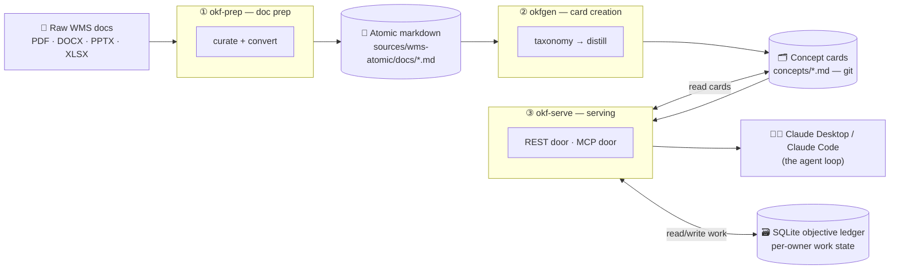
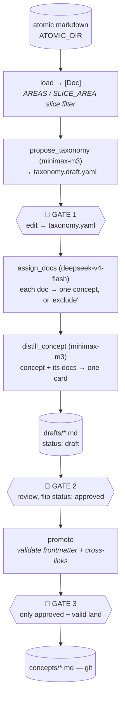
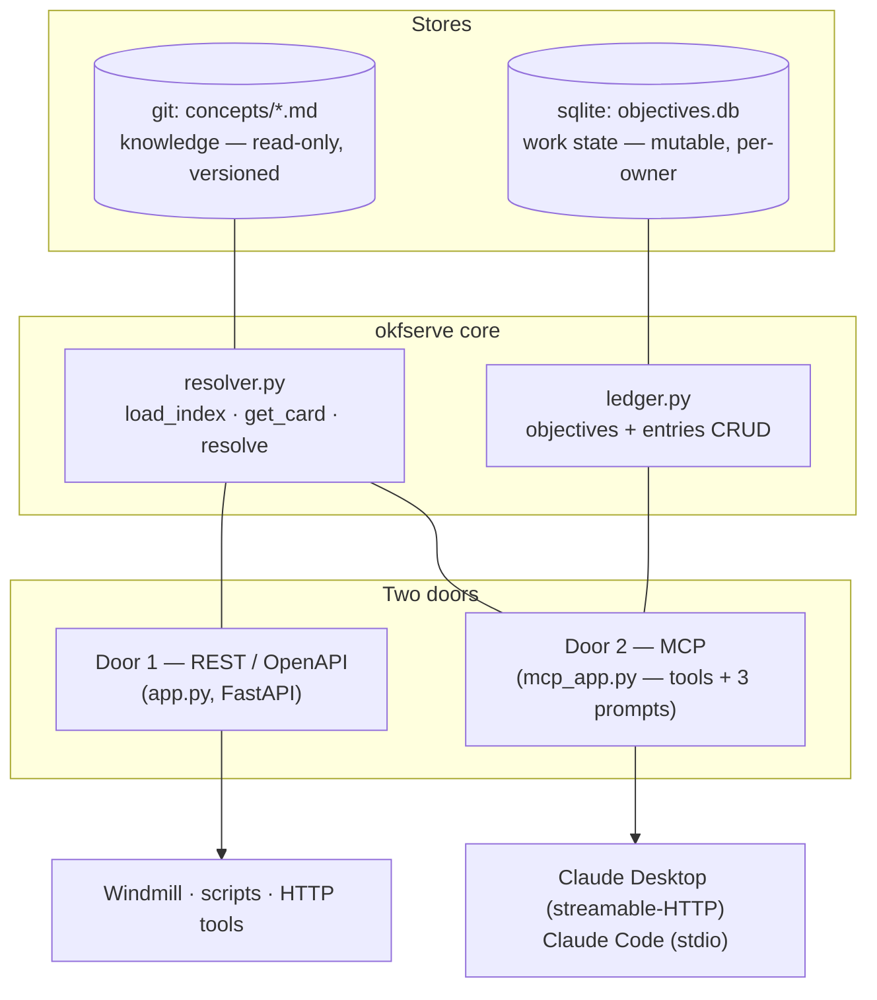
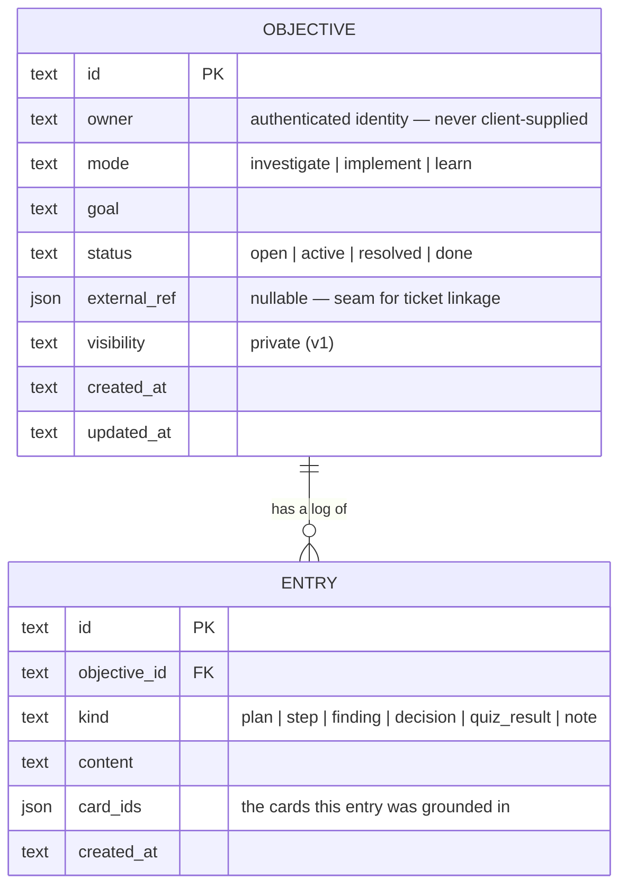
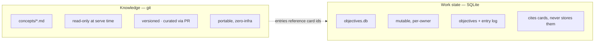
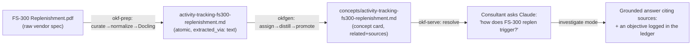
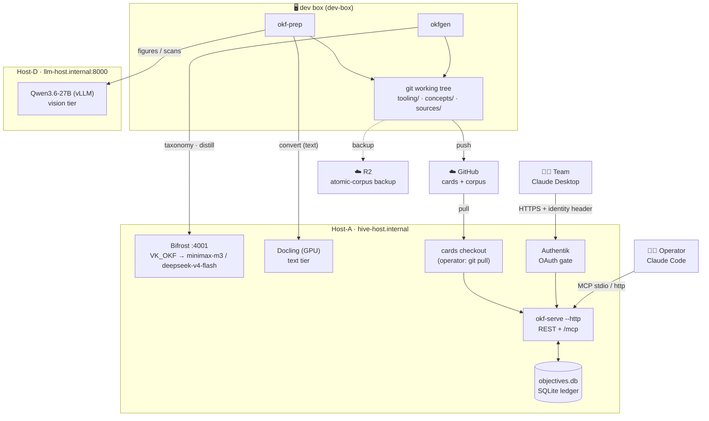

# OKF — The Organizational Knowledge Fabric, End to End

> **What this page is.** A single, self-contained explainer of how OKF works from a raw
> vendor document all the way to a grounded answer inside Claude — the *why*, the *flow*,
> and the *code*. It is meant for you and for anyone who needs to understand how this piece
> came to be and how it runs end to end. Diagrams are [Mermaid](https://mermaid.js.org/)
> and render inline on GitHub.

> **Currency note (2026-07-10).** This doc's three-stage spine (prep → cards → serve) still holds, but
> the pipeline has since grown to **4 Manhattan products** (WMOS 832 + oSCI 60 + Slotting 34 + Labour
> Management 64 = **990 concept cards**, plus a **corrections overlay** — 991 cards total live) and changed
> shape in four ways the sections below now reflect: (1) cards are **namespaced into per-product folders**
> with **path-ids** (`concepts/<product>/<id>.md`, id = the path); (2) a **post-promote step** (facets →
> conformance → index — the *"Stage 5"* in run-order) sits between card creation and serving (see the
> subsection near the end of §4); (3) a **product-isolation eval gates every deploy**; (4) a **corrections
> layer** (Spec 2) overlays wrong/stale concept cards with `type: correction` cards that co-pull at query
> time without editing the original (see *"The corrections layer"* in §4). Full history + lessons: memory
> `project_okf_knowledge.md` + `project_okf_osci_distillation.md`; PRs #9–#15.

---

## Contents

1. [The big picture](#1-the-big-picture)
2. [Design principles](#2-design-principles)
3. [Stage 1 — Document preparation (`okf-prep`)](#3-stage-1--document-preparation-okf-prep)
4. [Stage 2 — Card creation (`okfgen`)](#4-stage-2--card-creation-okfgen)
5. [Stage 3 — Serving: connectors + stateful SQLite (`okf-serve`)](#5-stage-3--serving-connectors--stateful-sqlite-okf-serve)
6. [The two stores: knowledge vs. work state](#6-the-two-stores-knowledge-vs-work-state)
7. [End-to-end walkthrough](#7-end-to-end-walkthrough)
8. [Complete file map](#8-complete-file-map)
9. [Running it](#9-running-it)
10. [Glossary](#10-glossary)

---

## 1. The big picture

OKF turns a pile of raw Manhattan **WMS** (Warehouse Management System) documentation into a
**curated, cross-linked knowledge base of atomic "concept cards" in git**, and serves those
cards to the team through **Claude** — with a per-person **stateful work ledger** underneath.
It is deliberately **small, simple, and sovereign**: it runs on the firm's own hardware, uses
git as its system of record, and adds exactly one piece of new infrastructure (a single SQLite
file) to the serving layer.

There are **three subsystems**, each a self-contained Python package under `tooling/`, chained
into one pipeline:



- **`okf-prep`** ([Stage 1](#3-stage-1--document-preparation-okf-prep)) — a human-gated,
  LLM-assisted pipeline that curates and converts raw docs into **atomic markdown** (one clean,
  single-topic file per source, with metadata frontmatter).
- **`okfgen`** ([Stage 2](#4-stage-2--card-creation-okfgen)) — distills that atomic markdown
  into **concept cards**: a proposed *taxonomy* of concepts, then one reusable card per concept,
  cross-linked into a graph. Cards live in `concepts/` and are versioned in git.
- **`okf-serve`** ([Stage 3](#5-stage-3--serving-connectors--stateful-sqlite-okf-serve)) — serves
  the cards through two "doors" (a REST/OpenAPI API and an **MCP** connector for Claude), over a
  **stateful objective ledger** in SQLite that tracks each person's investigations, implementation
  work, and learning.

**The whole thing is LLM-free at serving time** — Claude (the team's Claude Desktop subscription,
and the operator's Claude Code) *is* the reasoning loop. The only server-side model calls happen
during content creation (Stages 1 and 2), on the firm's own gateway.

---

## 2. Design principles

These are the "banked decisions" the whole system is built on:

| Principle | What it means in practice |
|---|---|
| **Sovereign** | Everything runs on the firm's hardware (Host-A/Host-D) via a local model gateway (Bifrost) and a self-hosted converter (Docling) + VLM (Qwen). No SaaS knowledge product, no external index. |
| **Git is the system of record** | Cards are plain markdown files. Curation gates = PR / diff / review. Zero-infra, portable, auditable. |
| **LLM proposes, human disposes, git records** | Every model stage writes a *reviewable artifact* and stops at a gate; nothing reaches the canonical corpus without a human flip. |
| **LLM-free serving** | The serving layer calls no model. Claude is the loop; the layer just retrieves cards and records work state. |
| **Two clean stores** | *Knowledge* (cards) is read-only, versioned git. *Work state* (the ledger) is mutable per-person SQLite. Never mixed. |
| **Small & recoverable** | One new piece of infra (a SQLite file). Fakes-only tests. Pipelines degrade gracefully (e.g. conversion runs GPU-free if the VLM is down). |

---

## 3. Stage 1 — Document preparation (`okf-prep`)

**Goal:** take a folder of raw, messy vendor docs and produce **atomic markdown** — one clean,
single-topic file per source document, labeled with metadata — that Stage 2 can distill.

**Package:** `tooling/okf-prep/` (package `okfprep`, CLI `okfprep`). Orchestrated end-to-end by
the [`/wms-prep`](../.claude/commands/wms-prep.md) command; the operational runbook is
[`docs/runbooks/wms-prep-e2e.md`](runbooks/wms-prep-e2e.md).

### The flow

The governing idea: **put the intelligence up front in one reviewable file, then let
deterministic code do the rest.** A single LLM "curation" pass decides *what to keep and how to
label it*; everything after is repeatable code. There are **two review gates** (🚦) where a human
must approve.


**Three kinds of actor**, and it helps to know which is which:

| Actor | Good at | Where |
|---|---|---|
| 🧠 **LLM** (Claude / the `wms-curator` agent) | judgment, reading content | **curate** (what to keep + how to label) |
| ⚙️ **Deterministic code** | repeatable, free | scan, dups, validate, dedup, normalize, transform, stamp |
| 👤 **You** | approval, accountability | the two review gates |

### The converter, in detail

`transform.py` profiles each normalized PDF (average characters/page, image-dominance) and
**routes** it:

- **text-rich** → the **text tier**: send the file to **Docling** on Host-A (best tables/layout),
  and *fall back to local `pymupdf4llm`* on any Docling failure — so the pipeline still runs with
  no GPU.
- **image-dominant** (a scan or a screenshot-heavy deck) → the **vision tier**: render each page
  and describe it with **Qwen3.6-27B** on Host-D (an OpenAI-compatible VLM). This tier replaced a
  retired GLM-4.1V model; the current WMS corpus is 100% born-digital, so it went 1,196 text +
  43 passthrough + 0 vision — the VLM is the fallback for future scanned material.
- **already-text formats** (`.vm/.xsd/.xml/.json/.sql/.properties`) → **passthrough**: fenced into
  markdown as-is.

Immediately before an atomic file is written, the converted markdown from the **text and vision
tiers** (never passthrough — you don't regex-scrub fenced code) is passed through the
**boilerplate stripper** (`stripper.py`): product-tunable YAML rules that remove copyright,
trademark notices, "all rights reserved", confidentiality lines, "Page X of Y" footers, and
table-of-contents dot-leaders. Rules are scoped to footer/header *form* so they can't delete real
prose, and the whole step is toggleable (`strip_boilerplate` / `strip_product`). This is separate
from `striptrim.py`, which removes strikethrough/tracked-change text earlier, at the `.docx` level
inside `normalize`.

Every atomic file gets frontmatter recording how it was made:

```yaml
---
title: "SCPP_Architecture"
slug: wms-scpp-architecture
topic: WMOS platform architecture
doc_type: technical-spec        # a closed vocabulary (validated)
version: unknown
product: WMS
platform: SCPP
source_doc: "SCPP_Architecture.pptx"
extracted_via: text             # text | vision | passthrough
status: active
---
```

### `okf-prep` file map

| File | Job |
|---|---|
| `cli.py` | The `okfprep` command group: `scan · dups · validate-plan · dedup-formats · normalize · route · transform · stamp · validate-atomic`. Builds the model clients from `.env` for `transform` only. |
| `config.py` | Env/`.env`-backed settings: corpus/work/atomic dirs, Docling + Qwen endpoints, routing thresholds. Model backends are **config-injected**, never hardcoded. |
| `scanner.py` | Walks a directory tree → an inventory CSV (path, size, type, folder-derived hints). |
| `folder_parser.py` | Parses folder names into classification hints (product/version/category priors). |
| `dups.py` | SHA-256 groups byte-identical files so the curator keeps one copy. |
| `curation_plan.py` | Loads + deterministically validates `wms-curation.yaml`; family-aware `.doc/.docx` variant dedup. |
| `slugs.py` | Slug helpers (`PASSTHROUGH_EXTS`, `slugify`, `assign_slugs`) — stable, de-collided slugs. |
| `libreoffice.py` | Converts office formats → PDF via headless LibreOffice. |
| `striptrim.py` | Removes struck-through / tracked-change text from a `.docx` before conversion. |
| `normalize.py` | Source doc → PDF intermediate (strike-trim `.docx`, LibreOffice the rest, copy PDFs). |
| `docling_client.py` | HTTP client for the **Docling** converter on Host-A (bytes → markdown). |
| `vision.py` | HTTP client for **Qwen3.6-27B** on Host-D (page image → markdown; describes figures). |
| `transform.py` | The 3-way router (text/vision/passthrough) + PDF profiling; runs the boilerplate stripper on text/vision output; writes atomic markdown with `extracted_via` frontmatter. |
| `stripper.py` (+ `stripper_rules/*.yaml`) | Scrubs copyright/trademark/confidentiality/page-number boilerplate from converted markdown via product-tunable, footer-scoped regex rules. |
| `stamp.py` | Fills invariant frontmatter (`platform/product/version/doc_type/topic`) from the curation plan. |
| `validate.py` | Validates the atomic corpus (unique slugs, `doc_type` enum, resolvable links) → derives `relations.yaml`. |

**The `wms-curator` agent** ([`.claude/agents/wms-curator.md`](../.claude/agents/wms-curator.md))
is the one judgment step: it reads the inventory + dups, spot-reads ambiguous files, and writes
`wms-curation.yaml` (include/exclude + content-derived labels). It never modifies source docs.

---

## 4. Stage 2 — Card creation (`okfgen`)

**Goal:** distill the atomic markdown into **concept cards** — reusable, cross-linked knowledge,
one card per concept.

**Package:** `tooling/okf-gen/` (package `okfgen`). It is **concept-centric** and, like `okf-prep`,
**gate-aware**: it does one stage, writes a reviewable artifact, and stops.

### The flow (3 gates)



- **Load** (`load.py`) reads atomic markdown into a source-agnostic `Doc {id, name, text}`. The
  **slice lever** is the `AREAS` registry + the `SLICE_AREA` env var: distillation runs one functional
  *area* at a time (topic → area map), so the corpus is built area-by-area and product-by-product rather
  than all at once. (The original single-slice `is_wave_replen()` keyword filter is retained but
  `# Legacy` — the very first wave/replen build used it; `AREAS`/`SLICE_AREA` replaced it.) All four
  products — WMOS, oSCI, Slotting, Labour Management — were distilled this way; **990 concept cards exist
  today** across `concepts/<product>/`.
- **Taxonomy** (`taxonomy.py`) asks the model for a fine-grained list of concepts → `taxonomy.yaml`
  (Gate 1: you curate *what concepts exist*).
- **Assign** (`assign.py`) classifies each doc into exactly one concept, or `exclude`.
- **Distill** (`card.py`) concatenates a concept's assigned docs and produces `{title, description,
  tags, related, body}` — the `related` ids are constrained to the real taxonomy so links can't be
  hallucinated. Output lands in `drafts/` as `status: draft` (Gate 2: you review and flip to
  `approved`).
- **Promote** (`promote.py`) validates required frontmatter and that every `related:` id resolves,
  then moves valid, approved drafts into `concepts/` (Gate 3).

Models run on the firm's **Bifrost** gateway via the `VK_OKF` virtual key (taxonomy/distill =
`minimax-m3`, assign = `deepseek-v4-flash`).

### The card, anatomy

A concept card is markdown with frontmatter + curated prose. The frontmatter makes it a node in a
graph (`related:` links + `sources:` provenance):

```yaml
---
type: concept
title: 2013 Replenishment Logic — Excess Wave Need Processing
description: Manhattan WMOS replenishment logic for moving inventory…
tags: [replenishment, wave, pick-location]
resource: https://hive.example.com/card/wms/base-replenishment-logic   # served-card URI
sources:
  - kind: wms-doc
    ref: wms-wmos-…-2013-replenishment-logic.md   # traces back to the atomic source
related:
  - wms/shipping-wave-replenishment-subprocess      # path-id edges into the concept graph
  - wms/replenishment-process-flow
distilled_at: '2026-06-30'
timestamp: '2026-06-30'          # OKF-recommended last-change field
status: approved
product: wms                     # facets: selection + isolation (product/platform/version/regime)
platform: wmos
version: ['2018', '2020']
---

## Overview
…self-contained, reusable prose (the bulk of the value)…

## Related
- [Shipping Wave Replenishment Subprocess](/wms/shipping-wave-replenishment-subprocess.md)
- [Replenishment Process Flow](/wms/replenishment-process-flow.md)

# Citations
1. `wms-wmos-…-2013-replenishment-logic.md`
```

The card lives at **`concepts/<product>/<id>.md`** and its **concept ID is that path** (`wms/base-replenishment-logic`) — the OKF-spec identity model. `## Related` (bundle-relative markdown links, regenerated from `related:`) and `# Citations` (from `sources:`) make the graph and provenance visible to any OKF consumer, not just okf-serve. The `product`/`platform`/`version`/`regime` facets drive selection + cross-product/regime isolation.

### `okfgen` file map

| File | Job |
|---|---|
| `load.py` | Read atomic markdown (local) or R2 into `Doc`s; the `AREAS`/`SLICE_AREA` slice filter (source-aware). Retains a `# Legacy` `is_wave_replen()`. |
| `taxonomy.py` | Propose a per-area concept taxonomy from the doc inventory (LLM) → `taxonomy.<area>.yaml`. |
| `assign.py` | Classify each doc into exactly one concept id, or `exclude`. |
| `card.py` | Distill a concept + its assigned docs → one OKF card (frontmatter + prose); constrains `related` to real ids. |
| `promote.py` | Validate frontmatter + cross-links; move approved drafts → `concepts/<product>/`. |
| `facets.py` | Idempotent stamp/read of the `product`/`platform`/`version`/`regime` facets; cross-facet lint. |
| `classify_regime.py` | LLM regime proposer (ops vs. traditional), human-gated, fail-safe — the batch classifier kept for future automation. |
| `retopic.py` | Re-map/merge concepts across a taxonomy revision (area re-slicing without a full re-distill). |
| `corrections.py` | The pure `record ⇄ correction-card` serialization seam (Spec 2) — feeds both the CLI and the GitHub Action. |
| `run.py` | Gate-aware orchestrator + entrypoint (taxonomy → assign+distill → drafts), area-scoped via `SLICE_AREA`. |
| `llm.py` | `BifrostChat` (OpenAI-compatible client, bounded retry) + `extract_json` (strips `<think>` reasoning, pulls JSON). |
| `config.py` | Settings: source (`ATOMIC_DIR` wins, else R2), Bifrost base/key, the three model slots, timeouts. |

### Post-promote — facets, conformance & index (the "Stage 5" run-order step)

Promote (gate 3) lands cards in `concepts/<product>/`, but they are not *servable-ready* until three
deterministic, **idempotent, LLM-free** scripts run over the whole `concepts/` dir. This is a
first-class pipeline step — run it after every distillation, for any product:

| Step | Script | What it does |
|---|---|---|
| **1. Facet stamp** | `okf-gen/scripts/product_facet_apply.py <concepts> <atomic> <product> <platform>` (oSCI uses `osci_facet_apply.py`) | Stamps `product` + `platform` + `version` (union of the card's source-doc folder-years) onto the product's cards. |
| **1b. Version facet** | `okf-gen/scripts/version_apply.py <concepts>` | Deterministically derives `version` (release scope) from source-ref years — no LLM, no gate. Soft filter-with-fallback (no `resolve()` guard). |
| **1c. Regime facet** | `okf-gen/scripts/regime_apply.py <concepts>` (proposals from `regime_classify.py`) | Stamps `regime` (ops vs. traditional, within-product either-or) from a human-reviewed classification; drives the cross-regime `resolve()` expansion guard. |
| **2. Conformance pass** | `okf-gen/scripts/conformance_pass.py <concepts>` | Sets `resource` → served-card URI; adds the OKF-recommended `timestamp`; regenerates `## Related` (bundle-relative markdown links, from `related:`) and `# Citations` (from `sources:`) body sections. |
| **3. Index generation** | `okf-gen/scripts/index_generate.py <concepts>` | Writes the root `index.md` (`okf_version: "0.1"` frontmatter) + per-product `index.md` progressive-disclosure listings (concepts only — corrections excluded). |

(The facet scripts are all **idempotent + LLM-free**; `version`/`regime` are optional per product — a product ships with `product`/`platform` always, `version`/`regime` where the source supports them.)

Why it exists: it takes the corpus from *formally* OKF-conformant (parseable frontmatter + non-empty
`type`) to *idiomatically* conformant — path-id identity, a graph expressed as inline bundle-relative
markdown links, `# Citations`, and a spec-shaped index. The scripts are idempotent, so re-running over
the full corpus leaves already-conformant cards untouched and only transforms new ones. (There is no
official OKF validator yet — `okf-lint` is a v0.0.1 stub — so conformance is checked by an in-repo audit
script against the spec text.)

**Isolation eval = the deploy gate.** Before deploy, `okf-serve/run_eval` over `data/<product>_product_qa.jsonl`
must show **0 cross-product bleed** (plus no regime/version regression). No product ships without it.

### The corrections layer (Spec 2)

A concept card can be **wrong or stale** without anyone wanting to edit the distilled prose (it's a
reviewed artifact, and edits lose the "what the source said" provenance). The corrections layer fixes this
with an **overlay**: a *correction* is an ordinary OKF card at `concepts/<product>/corrections/<slug>.md`
with `type: correction` and `corrects: <path-id>` pointing at the concept it amends.

- **Surface-don't-resolve.** `okf-serve`'s `resolve()` reverse-looks-up the **active** corrections
  (`type: correction` **and** `status: approved`) of every selected concept and **co-pulls** them into the
  answer bundle *after* the concept's own BFS/budget — intentionally **unbudgeted** (a correction is never
  dropped, or the wrong fact would stand). The answer prompt treats a correction as **authoritative**.
- **Never selected, never listed.** Corrections are excluded from the selectable index (`list_concepts` +
  the agent selector) and from per-product `index.md` listings — they only ride along with their target.
- **Supersede, don't delete.** A newer correction can `supersedes:` older ones, flipping them to
  `status: superseded` (kept in git for history). Conflicts (>1 active correction on one concept) are a
  **lint warning** for human resolution, not an auto-merge.
- **Authoring is GitHub-native.** Two entry points feed one **pure `record ⇄ card` seam**
  (`okfgen/corrections.py`): a CLI (`scripts/new_correction.py`) and an **Issue Form → Action**
  (`.github/ISSUE_TEMPLATE/correction.yml` → `.github/workflows/correction-from-issue.yml`, fires on label
  `okf-correction-approved` → opens a PR). `CODEOWNERS` routes each product's corrections dir to the owner;
  `scripts/corrections_lint.py` (+ the `corrections-lint` CI workflow) gates dangling targets, bad
  supersedes, status inconsistency, and conflicts.

| Script / file | Job |
|---|---|
| `okf-gen/okfgen/corrections.py` | Pure `record_to_correction` / `correction_to_record` seam (shared by CLI + Action). |
| `okf-gen/scripts/new_correction.py` | CLI: scaffold a `status: draft` correction card under `concepts/<product>/corrections/`. |
| `okf-gen/scripts/correction_from_issue.py` | Parse a Correction Issue-Form body → record → card (product allowlist-guarded against path traversal). |
| `okf-gen/scripts/corrections_lint.py` | Lint: dangling `corrects`, bad `supersedes`, status inconsistency, >1-active conflict warning. |

Design + acceptance: `docs/superpowers/specs/2026-07-09-okf-corrections-layer-design.md`. Shipped in PR #15;
verified live (a seeded correction on `slotting/data-requirements` co-pulls and overrides at query time).

---

## 5. Stage 3 — Serving: connectors + stateful SQLite (`okf-serve`)

**Goal:** serve the cards to people and tools, and track each person's *work* — without
re-introducing a heavy retrieval stack. Claude is the reasoning loop; this layer is LLM-free.

**Package:** `tooling/okf-serve/` (package `okfserve`, CLI `okfserve`).

### One core, two doors, two stores



Two transports, one codebase (`server.py`): `okfserve serve --stdio` runs the MCP server over
stdio (the operator's Claude Code); `okfserve serve --http` serves the REST routes **and** a
mounted MCP streamable-HTTP app from one FastAPI process (the team, behind Authentik).

### Door 1 — REST / OpenAPI (`app.py`)

The universal HTTP face (auto-generated OpenAPI at `/docs`). Read-only in v1.

| Method | Path | Returns |
|---|---|---|
| `GET` | `/healthz` | liveness |
| `GET` | `/concepts` | the card index `[{id, title, description}]` |
| `GET` | `/card/{id}` | one card's markdown (404 if missing) |
| `POST`| `/resolve` | `{ids, depth}` → a bundle of cards + their cross-linked neighbours, **plus any active corrections** of the selected concepts (co-pulled, authoritative) |

### Door 2 — MCP (`mcp_app.py`)

The connector Claude speaks. It exposes **9 tools** and **3 prompts**.

- **Read tools** (wrap the resolver): `list_concepts`, `get_card`, `resolve`.
- **Ledger tools** (the stateful part): `start_objective`, `list_objectives`, `get_objective`,
  `append_entry`, `set_status`, `record_quiz_result`.
- **Three mode prompts** = the three "agents", each a persona plus the standing rules to
  *ground every claim in a card's `sources:`* and *track the work in the ledger*:
  - **`investigate(symptom)`** — root-cause an issue; log hypotheses, evidence, ruled-out causes → resolution.
  - **`implementation_advisor(task)`** — advise on an implementation; log steps, decisions, trade-offs → plan/done.
  - **`guided_learning(topic)`** — build a curriculum from the card graph, teach one concept at a time, quiz, record scores, resume from progress.

### The stateful store — the SQLite objective ledger (`ledger.py`)

The one new piece of infrastructure: a single SQLite file at `OKF_DATA_DIR/objectives.db`
(WAL mode). It holds **work state**, never knowledge — just the trail of work plus citations back
to the cards. All three modes share **one** abstraction: an *objective* with a log of *entries*.



**Identity & owner-scoping.** The app is auth-agnostic. It reads the caller's identity from a
**trusted header injected by Authentik** (`identity.py`) and keys every row on it as `owner`; for
stdio (Claude Code, no Authentik) it falls back to a configured `OKF_DEFAULT_OWNER`. `owner` is
**always** derived server-side, never a tool parameter — one person can never read or write
another's objectives. The `external_ref` and `visibility` columns are designed-in seams (ticket
linkage; team-shared objectives) that are present but unused in v1.

### A stateful mode in motion

How `investigate` actually runs — Claude Desktop is the loop; the layer just retrieves and records:

```mermaid
sequenceDiagram
    actor U as Consultant
    participant C as Claude Desktop
    participant M as okf-serve (MCP door)
    participant G as git cards
    participant L as SQLite ledger

    U->>C: /investigate "waves running slow"
    C->>M: start_objective(mode=investigate, goal=…)
    M->>L: INSERT objective (owner=alice)
    C->>M: list_concepts() ; resolve(["wave-replen"], depth=1)
    M->>G: read cards + neighbours
    G-->>C: card bundle (with sources:)
    C->>M: append_entry(kind=finding, content=…, card_ids=["wave-replen"])
    M->>L: INSERT entry
    C-->>U: grounded hypothesis, cites [wms-doc.md]
    U->>C: (later) "it was replen lagging"
    C->>M: set_status(resolved) + append_entry(decision)
    M->>L: UPDATE + INSERT
    Note over C,L: Next session, get_objective(id) rehydrates the whole trail.
```

### `okf-serve` file map

| File | Job |
|---|---|
| `resolver.py` | The pure resolver: `load_index` / `get_card` / `resolve(ids, depth, caps)`. Reads cards live from `CONCEPTS_DIR`. |
| `tools.py` | Transport-agnostic read tools wrapping the resolver. |
| `ledger.py` | SQLite objective ledger — `objective` + `entry` CRUD, owner-scoped, enum-validated. **The stateful core.** |
| `identity.py` | Resolve `owner` from the trusted header (case-insensitive), else `OKF_DEFAULT_OWNER`. |
| `prompts.py` | The three mode-prompt bodies (grounding rule + ledger-tracking rule). |
| `app.py` | Door 1 — FastAPI REST router (`/healthz`, `/concepts`, `/card/{id}`, `/resolve`). |
| `mcp_app.py` | Door 2 — FastMCP server: 9 tools + 3 prompts. Injects `owner` from the request context. |
| `server.py` | Entrypoint: `serve --stdio` \| `--http`; mounts the MCP streamable-HTTP app on FastAPI. |
| `config.py` | Settings: `concepts_dir`, `okf_data_dir`, host/port/transport, `identity_header`, `okf_default_owner`. |
| `index.py` | (Content tooling) emits `index.md`, the progressive-disclosure entry point over the cards. |
| `agent.py`, `eval.py`, `run_eval.py` | (Eval tooling) the LLM select/answer harness that *proved* the no-RAG curated tier (14/14 wave/replen Qs). Not on the serving path. |

Deploy is operator-run behind Authentik — see
[`docs/runbooks/okf-serve-authentik.md`](runbooks/okf-serve-authentik.md).

---

## 6. The two stores: knowledge vs. work state

The cleanest way to hold the whole system in your head:



Knowledge is *what is true about WMS*; work state is *what a person is doing about it*. They only
touch through **citations**: an entry records the `card_ids` it was grounded in. Blow away the
ledger and you lose work history, not knowledge; the cards are untouched.

---

## 7. End-to-end walkthrough

Follow one thread all the way through:



1. **Prep.** The raw `FS-300 Replenishment.pdf` is curated (kept, labeled `functional-flow`,
   `product: WMS`), normalized to PDF, and Docling-converted to clean atomic markdown with
   frontmatter. → `sources/wms-atomic/docs/…fs300-replenishment.md`.
2. **Create.** `okfgen` proposes an `activity-tracking-fs300-replenishment` concept, assigns this
   doc (and any siblings) to it, and distills a card — cross-linked to `base-replenishment-logic`,
   citing the atomic source. After review it's promoted to `concepts/`.
3. **Serve.** A consultant, in Claude Desktop, invokes the **investigate** prompt. Claude calls
   `resolve(["activity-tracking-fs300-replenishment"])`, reads the card + neighbours, and answers —
   **citing the card's `sources:`**. It opens an objective and logs its findings to the SQLite
   ledger, so the investigation can be resumed later or shared (via the designed-in seams).

No vector database, no re-embedding, no external index — just git files and Claude, with a thin
SQLite memory.

---

## 8. Complete file map

Every code file in the pipeline and its one-line job.

### `tooling/okf-prep/okfprep/` — Stage 1, doc prep
`cli.py` · `config.py` · `scanner.py` · `folder_parser.py` · `dups.py` · `curation_plan.py` ·
`slugs.py` · `libreoffice.py` · `striptrim.py` · `normalize.py` · `docling_client.py` ·
`vision.py` · `transform.py` · `stripper.py` (+ `stripper_rules/`) · `stamp.py` · `validate.py`
— see the [okf-prep file map](#okf-prep-file-map).

### `tooling/okf-gen/okfgen/` — Stage 2, card creation
`load.py` · `taxonomy.py` · `assign.py` · `card.py` · `promote.py` · `facets.py` · `classify_regime.py` ·
`retopic.py` · `corrections.py` · `run.py` · `llm.py` · `config.py` — see the [okfgen file map](#okfgen-file-map).
Post-promote + authoring scripts live in `tooling/okf-gen/scripts/` (`product_facet_apply.py` ·
`osci_facet_apply.py` · `version_apply.py` · `regime_apply.py` · `regime_classify.py` ·
`conformance_pass.py` · `index_generate.py` · `new_correction.py` · `correction_from_issue.py` ·
`corrections_lint.py` · `run_pipeline.sh`).

### `tooling/okf-serve/okfserve/` — Stage 3, serving
`resolver.py` · `tools.py` · `ledger.py` · `identity.py` · `prompts.py` · `app.py` · `mcp_app.py` ·
`server.py` · `config.py` (+ content/eval tooling `index.py`, `agent.py`, `eval.py`, `run_eval.py`)
— see the [okf-serve file map](#okf-serve-file-map).

### Data & config (git-tracked)
| Path | Role |
|---|---|
| `sources/wms-atomic/docs/*.md` | The WMS atomic-markdown corpus (Stage 1 output, Stage 2 input). |
| `sources/wms-atomic/_curation/` | The WMS curation judgment (`wms-curation.yaml`, `relations.yaml`, `dups.yaml`, …). |
| `tooling/okf-prep/{osci,slotting,lm}-curation.yaml` | The curation judgment for the 3 later products (oSCI/Slotting/LM). |
| `taxonomy.<area>.yaml` | The approved per-area concept taxonomies (Stage 2 Gate 1). Draft proposals are gitignored scratch. |
| `regime-classification.yaml` | The human-reviewed regime labels (WMS), applied by `regime_apply.py`. |
| `drafts/*.md` | Distilled cards awaiting approval (Stage 2 Gate 2) — gitignored scratch. |
| `concepts/<product>/*.md` | **The canonical concept cards** (the knowledge store). |
| `concepts/<product>/corrections/*.md` | **Correction overlay cards** (Spec 2) — co-pulled, never independently listed. |
| `.claude/agents/wms-curator.md` | The curation subagent. |
| `.claude/commands/wms-prep.md` | The `/wms-prep` orchestration command. |
| `docs/runbooks/*.md` | Operator runbooks (doc-prep e2e; okf-serve Authentik deploy). |

### Infrastructure (external, sovereign)
| Thing | Where | Used by |
|---|---|---|
| **Bifrost** gateway (`VK_OKF`: minimax-m3 + deepseek-v4-flash) | Host-A `:4001` | okfgen (taxonomy/assign/distill) |
| **Docling** converter | Host-A GPU | okf-prep text tier |
| **Qwen3.6-27B** VLM (vLLM) | Host-D `llm-host.internal:8000` | okf-prep vision tier |
| **Authentik** | in front of okf-serve | serving identity/auth |

### Deployment topology

Where each piece runs, and how the model calls, git, and connectors flow across the network:



**Reading it:** content creation (Stages 1–2) runs on the **dev box**, calling the sovereign models
on **Host-A** (Bifrost, Docling) and **Host-D** (Qwen); its output is committed to **git** and pushed to
**GitHub**, with the atomic corpus mirrored to **R2**. Serving (Stage 3) runs on **Host-A** from a
cards checkout the operator keeps current with `git pull` (no redeploy for content updates); the team
reaches it through **Authentik**, which injects the identity header the ledger keys work on.

---

## 9. Running it

```bash
# ── Stage 1: prep raw docs → atomic markdown (human-gated) ──────────────
cd tooling/okf-prep && uv sync --extra dev
#   configure .env: CORPUS_ROOT, DOCLING_BASE(+auth), QWEN_BASE, QWEN_MODEL
#   then, in Claude Code, run the orchestration:  /wms-prep <subtree> <work_dir>
#   (scan → dups → wms-curator → validate-plan → 🚦 → dedup → normalize →
#    route → 🚦 → transform → stamp → validate-atomic)

# ── Stage 2: atomic markdown → concept cards (3 gates) ──────────────────
cd tooling/okf-gen && uv sync --extra dev
#   register the product's areas in okfgen/load.py AREAS (topic→area)
#   set ATOMIC_DIR + Bifrost VK_OKF in .env; run per area: SLICE_AREA=<area>
SLICE_AREA=<area> python -m okfgen.run   # gate 1: writes taxonomy.<area>.draft.yaml, stops
#   review → save as taxonomy.<area>.yaml → re-run for drafts/ (gate 2)
#   flip status: approved → promote(drafts, concepts, <product>) → concepts/<product>/ (gate 3)

# ── Stage 2b (run-order "Stage 5"): facets → conformance → index ────────
python scripts/product_facet_apply.py ../../concepts <atomic> <product> <platform>
python scripts/conformance_pass.py    ../../concepts     # resource-URI, timestamp, ## Related, # Citations
python scripts/index_generate.py      ../../concepts     # root + per-product index.md
#   then: isolation eval must pass 0-bleed before deploy (okf-serve/run_eval)

# ── Stage 3: serve the cards to Claude + track work in SQLite ───────────
cd tooling/okf-serve && uv sync --extra dev
uv run okfserve serve --stdio     # local: register as an MCP server in Claude Code
uv run okfserve serve --http      # team: REST + mounted MCP behind Authentik
#   deploy details → docs/runbooks/okf-serve-authentik.md
```

All three packages test **fakes-only**: `cd tooling/<pkg> && uv sync --extra dev && uv run pytest -q`.

---

## 10. Glossary

| Term | Meaning |
|---|---|
| **OKF** | Organizational Knowledge Fabric — this whole system. |
| **WMS / WMOS** | Manhattan Warehouse Management System; WMOS = WMS-on-SCPP. The domain. |
| **Atomic markdown** | One clean, single-topic markdown file per source doc, with metadata frontmatter. Stage 1 output. |
| **Concept card** | A reusable, cross-linked knowledge card distilled from atomic docs. Stage 2 output; the unit of knowledge. |
| **Taxonomy** | The approved list of concepts (`taxonomy.yaml`) that cards are distilled against. |
| **Objective / entry** | The stateful work unit in the ledger: an objective (a mode + goal + status) with a log of entries citing cards. |
| **Mode** | One of `investigate` / `implementation_advisor` / `guided_learning` — an MCP prompt persona over the ledger. |
| **Door** | A way in: the REST/OpenAPI API, or the MCP connector for Claude. |
| **Gate** | A human review/approval checkpoint where the pipeline stops. |
| **Bifrost / `VK_OKF`** | The firm's LLM gateway and the virtual key scoped to OKF's models. |
| **Docling / Qwen** | The self-hosted document converter (text tier) and vision model (vision tier) in Stage 1. |

---

*This document describes the system as of the corrections-layer merge (2026-07-10; PRs #9–#15): 4 products
(990 concept cards + a corrections overlay = 991 live), per-product folders with path-ids, post-promote
facets/conformance/index, isolation-gated deploys, and a `type: correction` overlay that co-pulls at query
time. The three packages live under `tooling/`; the knowledge lives in `concepts/<product>/`; the work
state lives in a single SQLite file.
Small, simple, sovereign.*
